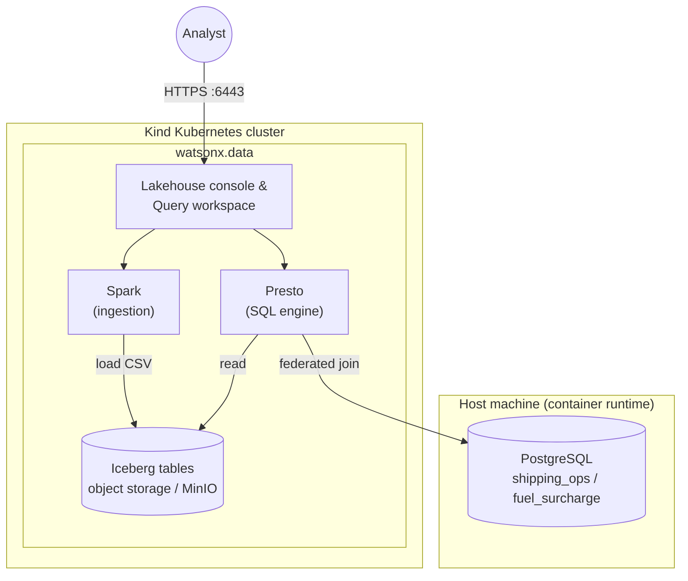

# Global Parcel Hybrid Lakehouse Demo

Part of the **[StreamHouse workshop](../README.md)** — this is the **query** session: **IBM watsonx.data** (Iceberg, Presto, PostgreSQL federation).

Follow-along demo for running **IBM watsonx.data** locally and walking through a Global Parcel scenario:

- Ingest shipping history into Iceberg
- Query operational insights with Presto
- Federate lakehouse data with PostgreSQL fuel surcharge rows

---

## Use case

Global Parcel wants governed analytics with data sovereignty in mind: historical parcel events stay in lakehouse storage, while **live** fuel surcharge values remain in PostgreSQL until you federate both in one SQL query—so invoice impact reflects **base rate + surcharge** by region.

You reproduce that flow end-to-end on a local **kind** cluster with watsonx.data Developer Edition where applicable.



---

## Working directory
**Assume your shell working directory is `01-data-federation/`.**

```bash
cd 01-data-federation
```

## Python dependencies

Here we build upon the [installation prerequisites](../README.md#install-prerequisites-all-sessions).
Assume the repository-root virtual environment is already active (`../.venv`).

Install the required Python dependencies for this session using the `requirements.txt`:

```bash
pip install -r requirements.txt
```

This will install key packages like `pandas` and `sqlalchemy`, needed to run the data generator scripts and interact with Postgres from Python.

---

## 2) Install paths: default (IBM) or manual (Kind + Helm) 🚀
Choose one of the following paths:

- **Path 1 (default, recommended):** Follow IBM's guided installer flow from **[Installing watsonx.data Standard](https://www.ibm.com/docs/en/watsonxdata/standard/2.3.x?topic=version-installing)**.
- **Path 2 (manual, advanced):** Set up Kind yourself, then deploy the chart from this repository with Helm.

Both paths target a local watsonx.data Developer Edition environment. Pick Path 1 for a faster setup; pick Path 2 for more control and troubleshooting.

### Path 1 - IBM default installation flow ✅
Use IBM documentation as the primary source of truth:

- Start at **[Installing watsonx.data Standard](https://www.ibm.com/docs/en/watsonxdata/standard/2.3.x?topic=version-installing)** to choose your OS-specific Developer Edition instructions (Mac, Windows, Linux).
- Download and extract the installer package from IBM
- Then follow the documented steps to start watsonx.data Developer Edition

This path is best if you want IBM's end-to-end defaults (runtime prep, cluster setup, and deployment flow handled by the installer script).

### Path 2 - Manual Kind + Helm installation (on Linux) ⚙️
Use this path if you want full control over cluster lifecycle and Helm values.

#### 2.1 Validate host readiness
Run the readiness script first:

```bash
./scripts/host_readiness.sh
```

#### 2.2 Create and validate your Kind cluster
Create the local cluster:

```bash
kind create cluster --name wxd
kubectl config use-context kind-wxd
```

Check Kubernetes readiness:

```bash
kubectl get nodes
watch kubectl get pods -n kube-system -o wide
```

What to look for:
- `kubectl get nodes` should show all nodes as `Ready`.
- In `kube-system`, core pods should settle to `Running` or `Completed`.
- If pods remain in `Pending`, `CrashLoopBackOff`, or similar, fix that before Helm install.

#### 2.3 Download IBM installer bundle, then run Helm manually
Even in manual mode, get the official package from IBM docs:

- Start from **[Installing watsonx.data Standard](https://www.ibm.com/docs/en/watsonxdata/standard/2.3.x?topic=version-installing)**.
- For Linux follow the package download/extract guidance in **[Installing watsonx.data developer edition on Linux(RHEL)](https://www.ibm.com/docs/en/watsonxdata/standard/2.3.x?topic=installing-watsonxdata-developer-edition-linuxrhel)**.

```bash
rm -rf ./watsonx.data-developer-edition-installer
tar -xvf watsonx.data-developer-edition-installer.tar
rm watsonx.data-developer-edition-installer.tar
```

Then install with Helm from the extracted `watsonx.data-developer-edition-installer` directory:

```bash
cd watsonx.data-developer-edition-installer
helm dependency update
helm upgrade --install wxd . \
  -f values.yaml \
  -f values-secret.yaml \
  --namespace wxd \
  --create-namespace \
  --timeout 10m
```

> [!NOTE]
> Adjust `values.yaml` and `values-secret.yaml` before install if you need custom resources, storage, or credentials.

### 3) Check watsonx.data readiness 🧪

```bash
watch kubectl get pods -n wxd
```

After a while, depending on your system this can take anything between a few minutes and 10's of minutes, you should see a similar status:

```text
NAME                                              READY   STATUS      RESTARTS   AGE
generate-certs-and-truststore-lwmm6               0/1     Completed   0          11m
ibm-lh-control-plane-prereq-45hl9                 0/1     Completed   0          10m
ibm-lh-mds-rest-7cc9bd5c9b-px5xw                  1/1     Running     0          8m52s
ibm-lh-mds-thrift-679698fd56-22ldx                1/1     Running     0          8m52s
ibm-lh-minio-7b6dfc69f8-88xgh                     1/1     Running     0          8m52s
ibm-lh-presto-5d8bfdbd77-892cw                    1/1     Running     0          8m52s
ibm-lh-validator-7877c94d95-j47qx                 1/1     Running     0          8m52s
image-pull-job-wzxfv                              0/1     Completed   0          8m51s
lhams-api-64874857bc-wndfz                        1/1     Running     0          8m53s
lhconsole-api-6767df9d79-xjxq4                    1/1     Running     0          8m53s
lhconsole-nodeclient-84fbc5b998-kb4pj             1/1     Running     0          8m53s
lhconsole-ui-79bd784dc9-zxmz2                     1/1     Running     0          8m52s
lhingestion-api-846498cb98-ntlm5                  1/1     Running     0          8m52s
spark-hb-control-plane-975c76d8-qmkd9             2/2     Running     0          8m51s
spark-hb-create-trust-store-9d577b768-2gsds       1/1     Running     0          9m9s
spark-hb-deployer-agent-c5444448c-kpzmd           2/2     Running     0          8m51s
spark-hb-load-postgres-db-specs-vgwrz             0/1     Completed   0          9m9s
spark-hb-nginx-8647978c8-g69fv                    1/1     Running     0          8m51s
spark-hb-register-hb-dataplane-6dd49b8f84-v9lbd   1/1     Running     0          5m36s
spark-hb-ui-c5bb88ccd-vjmhf                       1/1     Running     0          8m51s
wxd-pg-postgres-0                                 1/1     Running     0          10m
```

### 4) Port-forward UI and dependencies 🌐

Forwarding on `0.0.0.0` lets other hosts reference your machine IP:

```bash
nohup kubectl port-forward -n wxd service/lhconsole-ui-svc 6443:443 --address 0.0.0.0 2>&1 &
nohup kubectl port-forward -n wxd service/ibm-lh-minio-svc 9001:9001 --address 0.0.0.0 2>&1 &
nohup kubectl port-forward -n wxd service/ibm-lh-mds-thrift-svc 8381:8381 --address 0.0.0.0 2>&1 &
```

> [!TIP]
> - **lhconsole-ui-svc (6443:443)** — The main watsonx.data UI; exposes the admin console for managing data, queries, and configuration.
> - **ibm-lh-minio-svc (9001:9001)** — MinIO object storage admin console, where you can observe and manage the underlying storage buckets used by the lakehouse.
> - **ibm-lh-mds-thrift-svc (8381:8381)** — Metadata Service endpoint, used internally by watsonx.data for catalog and privilege operations (not typically needed for direct user interaction).

Open **`https://localhost:6443/`**. Expect a browser warning for the Development/TLS certificate—continue for local demos only (`ibmlhadmin` / `password` unless you changed defaults).

---

## 5) Follow-along — Load shipping history into Iceberg 📦

When logistics markets are in flux, it’s vital to pinpoint **where delays concentrate** and **how baseline shipping costs** vary by origin. This foundational insight empowers accurate pricing discussions and proactive service management—*before* surcharges become a factor. In a real-world scenario, Global Parcel’s backend tracks shipping events and periodically exports this as Parquet on object storage for analytics.

### Generate a sample shipping history

For this lab, we simulate the backend by generating a CSV file representing historical shipments. Next, you’ll use watsonx.data’s Spark engine to convert this CSV to a Parquet-based Iceberg table for efficient analytics.

To generate the CSV:

```bash
python scripts/generate_shipping_history.py
```

### Load CSV into watsonx.data

1. Open `https://localhost:6443/` and sign in (`ibmlhadmin` / `password`).
2. Navigate to **Infrastructure manager → Add component → IBM Spark** (`Next`).
3. Display name (for example `spark-01`); associate catalog **`iceberg_bucket`**.
4. Navigate to **Data manager → `iceberg_data` → ⋮ → Create schema** named **`shipping_backend`**.
5. Under **`shipping_backend` → ⋮ → Create table from file** and select **`shipping_history.csv`** which you just generated in **`01-data-federation/`**.
6. Target table **`shipping_history`**, select your just created Spark engine, then click **Done**.
7. On the **Ingestion history** tab click the refresh button to check the progress.

### Query delayed shipments

Navigate to **Query workspace** and run the following query:

```sql
SELECT origin_city, COUNT(*) AS volume, AVG(shipping_cost) AS avg_cost
FROM iceberg_data.shipping_backend.shipping_history
WHERE status = 'Delayed'
GROUP BY origin_city
ORDER BY volume DESC;
```

Bingo! We have a clear overview of the delays for parcel delivery!

---

## 6) Follow-along — Fuel Surcharge in PostgreSQL (Federated) ⛽

It’s the fate of every global shipper: just as supply chains settle, **fuel prices spike**. Overnight, invoices bloat with mysterious surcharges. Did you overpay? Or did your margins simply vanish, line by line? Welcome to the world where finance and operations collide, and only the data will tell you who won.

Ready to chase down these elusive fuel surcharges? Time to build the real story—by joining **parcel history** (Iceberg) with fresh, volatile **fuel prices** (PostgreSQL) in a single, panoramic query.

### Start PostgreSQL

Global Parcel works with an external supplier to acquire a database with fuel surcharge pricing. This database is provided as PostgreSQL. In this lab, we simulate it by running PostgreSQL in Docker.

```bash
docker run --name shipping-postgres \
  -e POSTGRES_PASSWORD=postgres \
  -e POSTGRES_DB=shipping_ops \
  -p 5432:5432 \
  -d postgres:latest
```

Now generate fuel surcharge reference data:

```bash
python scripts/generate_fuel_surcharge.py
```

This writes **`fuel_surcharge.csv`** in `01-data-federation/` as well as storing it into your newly started Postgresql database.

To confirm the fuel surcharge data loaded correctly, you can connect to the running Postgres container and inspect the data:

1. Start a shell inside the container:
```bash
docker exec -it shipping-postgres psql -U postgres -d shipping_ops
```
2. List available tables:
```sql
\dt
```
3. View the fuel surcharge table contents:
```sql
SELECT * FROM fuel_surcharge;
```

You should see the region and fuel surcharge values. To exit the `psql` session, type `\q`.


### Connection string for watsonx.data (host-visible IP)
The below commands will get you the full connection string for Postgresql. We just need the IP number for watsonx.data:

```bash
# For Linux:
printf 'postgresql://postgres:postgres@%s:5432/shipping_ops\n' "$(hostname -I | awk '{print $1}')"

# For macOS:
printf 'postgresql://postgres:postgres@%s:5432/shipping_ops\n' "$(ipconfig getifaddr en0)"

# For Windows (PowerShell):
Write-Host "postgresql://postgres:postgres@$(Get-NetIPAddress -AddressFamily IPv4 | Where-Object { $_.IPAddress -notlike '127.*' -and $_.InterfaceAlias -match 'Wi-Fi|Ethernet' } | Select-Object -First 1 -ExpandProperty IPAddress):5432/shipping_ops"
```

Use that `host IP` where the workload inside the cluster can reach Postgres on your workstation (typically your LAN/Wi‑Fi address, **not** `127.0.0.1`).

### Add PostgreSQL as a federated catalog

This step configures **watsonx.data** to "federate" (connect to and query) your running PostgreSQL instance. You're adding your Postgres database—populated with the fuel surcharge data—as a new federated catalog inside watsonx.data. 

By doing so, queries executed via Presto on watsonx.data can seamlessly JOIN data from your Iceberg tables **and** from this live Postgres table (`fuel_surcharge`) in the same SQL statement. This is what IBM refers to as a **zero-copy** approach: data remains in-place in each system, with no need to duplicate or physically move the data. Instead, federation makes both historical and live/operational data queryable "as one"—with **zero-copy access**.

The instructions walk you through using the watsonx.data infrastructure manager UI to register the Postgres connection (fuel surcharge data) with the right network info, credentials, and catalog name (`shipping_ops`). After this, your lakehouse SQL can tap into both historical and live operational data in a unified way, without copying or ETL overhead.

1. Navigate to **Infrastructure manager → Add component → PostgreSQL**.
2. Example fields:
   - Display name: `Fuel surcharge pricing`
   - Database name: `shipping_ops`
   - Hostname: IP from the command above (reachable from pods)
   - Port: `5432`
   - Username / password: `postgres` / `postgres`
3. Click **Test connection** to validate access to the database works.
4. Check `Associate catalog`:
  - Catalog name: `shipping_ops`
5. Click `Create`

Now associate the catalog with Presto for federated querying:

1. On **Infrastructure manager** hover over the newly created catalog `shipping_ops`.
2. Click `Manage associations`
3. Check `presto-01` and click `Save and restart engine`

### Query shipping + fuel surcharge

This step demonstrates how to query both the historical parcel shipping data (stored in Iceberg tables) and the *live* fuel surcharge reference data (in PostgreSQL, federated via watsonx.data) together in a single SQL query. 

You’re joining the shipping cost for each package with the current fuel surcharge for its region, calculating the full invoice total on the fly. The join operation here is powered by Presto’s ability to access data from *multiple backends* (your Iceberg tables and the federated PostgreSQL catalog) as if they were all part of the same database. 

**What’s important:**  
- `iceberg_data.shipping_backend.shipping_history` is your historical shipping cost data.
- `shipping_ops.public.fuel_surcharge` represents the live fuel surcharge table exposed from PostgreSQL.
- The result gives you, for each package, the base shipping rate, the region's current fuel surcharge, and the computed invoice total—**without duplicating or transferring any data across systems**.

This is a core advantage of data federation: operational and analytical data can be kept in the systems where they belong, recombined at query time, making analytics more accurate and infrastructure more efficient.

```sql
SELECT
  s.package_id,
  s.region,
  s.shipping_cost AS base_rate,
  f.fuel_surcharge,
  (s.shipping_cost + f.fuel_surcharge) AS total_invoice
FROM iceberg_data.shipping_backend.shipping_history s
JOIN shipping_ops.public.fuel_surcharge f ON s.region = f.region
LIMIT 10;
```

---

## Recap

You stored parcel history in **Iceberg**, explored it with **Presto**, joined **PostgreSQL** surcharge rows in one query—so totals reflect governed history plus operational reference data **without** duplicating surcharge ETL every time indexes move.

Hybrid patterns (**Iceberg**, Presto-class SQL, standard DB connectivity) align with sovereignty and portability: authoritative events stay where policy allows while joins reach systems you already operate.

---

## Operations

### Stop or resume local cluster

```bash
docker stop wxd-control-plane
docker start wxd-control-plane
```

### Tear down

```bash
kind delete cluster --name wxd
docker rm -f shipping-postgres
docker system prune -a      # destructive; removes unused Docker data
```