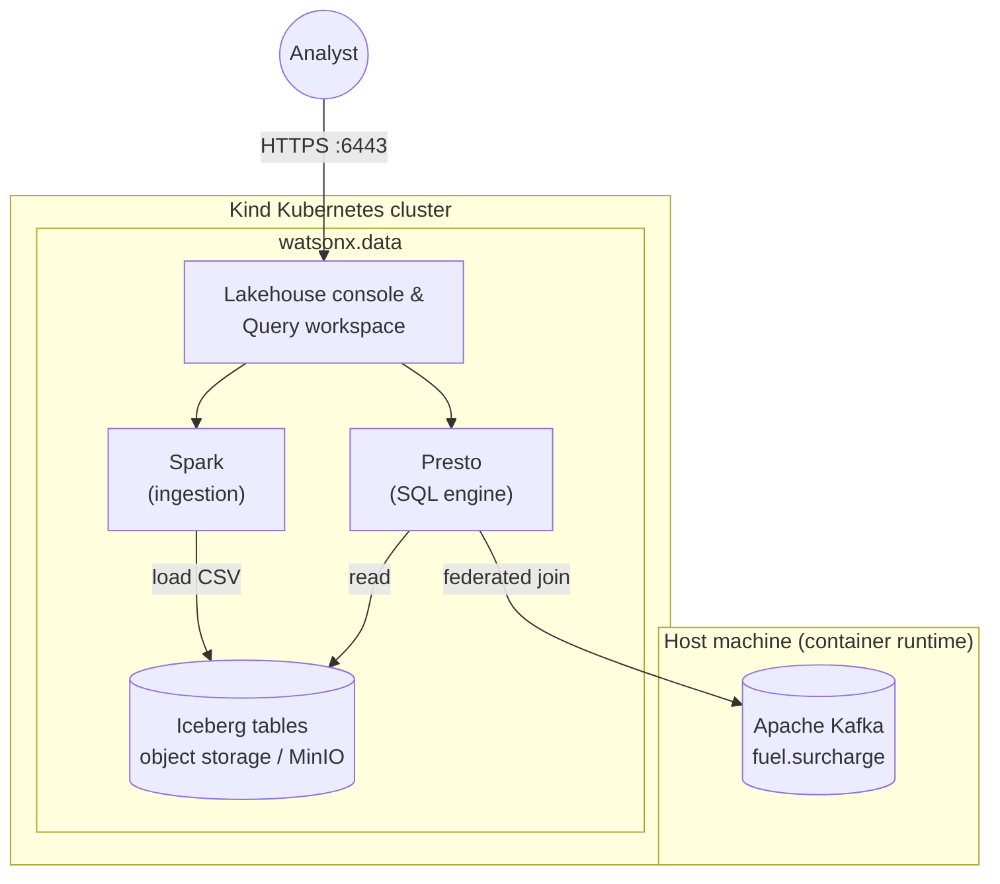

# 02 — Query the lakehouse 🧊

Part of the **[StreamHouse workshop](../README.md)** — the **query** chapter: **IBM watsonx.data** (Iceberg, Presto, Kafka federation) on the parcels you already captured.

- Load those events into Iceberg
- Query operational insights with Presto
- Join lakehouse history with the live Kafka `fuel.surcharge` topic

---

## Use case

Global Parcel wants governed analytics with data sovereignty in mind: historical parcel events stay in lakehouse storage, while **live** fuel surcharge values stay on Kafka until you federate both in one SQL query—so invoice impact reflects **base rate + surcharge** by region.

You reproduce that flow end-to-end on a local **kind** cluster with watsonx.data Developer Edition where applicable.



---

## Working directory

Capture and tableflow should already have written `01-streamhouse/data/warehouse/`. Leave chapter 01 blocking jobs (produce, shift-left, materialize, tower) running in their terminals.

**New terminal** (activate):

```bash
cd 02-lakehouse
source ../.venv/bin/activate   # same workshop venv as chapter 01
```

---

## 2) Install paths: default (IBM) or manual (Kind + Helm) 🚀
Choose one of the following paths:

- **Path 1 (default, recommended):** Follow IBM's guided installer flow from **[Installing watsonx.data Standard](https://www.ibm.com/docs/en/watsonxdata/standard/2.3.x?topic=version-installing)**.
- **Path 2 (manual, advanced):** Set up Kind yourself, then deploy the chart from this repository with Helm.

Both paths target a local watsonx.data Developer Edition environment. Pick Path 1 for a faster setup; pick Path 2 for more control and troubleshooting.

### Path 1 - IBM default installation flow ✅
Use IBM documentation as the primary source of truth:

- Start at **[Installing watsonx.data Standard](https://www.ibm.com/docs/en/watsonxdata/standard/2.3.x?topic=version-installing)** to choose your OS-specific Developer Edition instructions (Mac, Windows, Linux).
- Download and extract the installer package from IBM
- Then follow the documented steps to start watsonx.data Developer Edition

This path is best if you want IBM's end-to-end defaults (runtime prep, cluster setup, and deployment flow handled by the installer script).

### Path 2 - Manual Kind + Helm installation (on Linux) ⚙️
Use this path if you want full control over cluster lifecycle and Helm values.

#### 2.1 Validate host readiness
Run the readiness script first:

```bash
./scripts/host_readiness.sh
```

#### 2.2 Create and validate your Kind cluster
Create the local cluster:

```bash
kind create cluster --name wxd
kubectl config use-context kind-wxd
```

Check Kubernetes readiness:

```bash
kubectl get nodes
watch kubectl get pods -n kube-system -o wide
```

What to look for:
- `kubectl get nodes` should show all nodes as `Ready`.
- In `kube-system`, core pods should settle to `Running` or `Completed`.
- If pods remain in `Pending`, `CrashLoopBackOff`, or similar, fix that before Helm install.

#### 2.3 Download IBM installer bundle, then run Helm manually
Even in manual mode, get the official package from IBM docs:

- Start from **[Installing watsonx.data Standard](https://www.ibm.com/docs/en/watsonxdata/standard/2.3.x?topic=version-installing)**.
- For Linux follow the package download/extract guidance in **[Installing watsonx.data developer edition on Linux(RHEL)](https://www.ibm.com/docs/en/watsonxdata/standard/2.3.x?topic=installing-watsonxdata-developer-edition-linuxrhel)**.

```bash
rm -rf ./watsonx.data-developer-edition-installer
tar -xvf watsonx.data-developer-edition-installer.tar
```

Then install with Helm from the extracted `watsonx.data-developer-edition-installer` directory:

```bash
cd watsonx.data-developer-edition-installer
helm dependency update
helm upgrade --install wxd . \
  -f values.yaml \
  -f values-secret.yaml \
  --namespace wxd \
  --create-namespace \
  --timeout 10m
```

> [!NOTE]
> Adjust `values.yaml` and `values-secret.yaml` before install if you need custom resources, storage, or credentials.

### 3) Check watsonx.data readiness 🧪

```bash
watch kubectl get pods -n wxd
```

After a while, depending on your system this can take anything between a few minutes and 10's of minutes, you should see a similar status:

```text
NAME                                              READY   STATUS      RESTARTS   AGE
generate-certs-and-truststore-lwmm6               0/1     Completed   0          11m
ibm-lh-control-plane-prereq-45hl9                 0/1     Completed   0          10m
ibm-lh-mds-rest-7cc9bd5c9b-px5xw                  1/1     Running     0          8m52s
ibm-lh-mds-thrift-679698fd56-22ldx                1/1     Running     0          8m52s
ibm-lh-minio-7b6dfc69f8-88xgh                     1/1     Running     0          8m52s
ibm-lh-presto-5d8bfdbd77-892cw                    1/1     Running     0          8m52s
ibm-lh-validator-7877c94d95-j47qx                 1/1     Running     0          8m52s
image-pull-job-wzxfv                              0/1     Completed   0          8m51s
lhams-api-64874857bc-wndfz                        1/1     Running     0          8m53s
lhconsole-api-6767df9d79-xjxq4                    1/1     Running     0          8m53s
lhconsole-nodeclient-84fbc5b998-kb4pj             1/1     Running     0          8m53s
lhconsole-ui-79bd784dc9-zxmz2                     1/1     Running     0          8m52s
lhingestion-api-846498cb98-ntlm5                  1/1     Running     0          8m52s
spark-hb-control-plane-975c76d8-qmkd9             2/2     Running     0          8m51s
spark-hb-create-trust-store-9d577b768-2gsds       1/1     Running     0          9m9s
spark-hb-deployer-agent-c5444448c-kpzmd           2/2     Running     0          8m51s
spark-hb-load-postgres-db-specs-vgwrz             0/1     Completed   0          9m9s
spark-hb-nginx-8647978c8-g69fv                    1/1     Running     0          8m51s
spark-hb-register-hb-dataplane-6dd49b8f84-v9lbd   1/1     Running     0          5m36s
spark-hb-ui-c5bb88ccd-vjmhf                       1/1     Running     0          8m51s
wxd-pg-postgres-0                                 1/1     Running     0          10m
```

### 4) Port-forward UI and dependencies 🌐

```bash
nohup kubectl port-forward -n wxd service/lhconsole-ui-svc 6443:443 2>&1 &
# You don't need the following services in this lab:
#nohup kubectl port-forward -n wxd service/ibm-lh-minio-svc 9001:9001 2>&1 &
#nohup kubectl port-forward -n wxd service/ibm-lh-mds-thrift-svc 8381:8381 2>&1 &
```

> [!TIP]
> - **lhconsole-ui-svc (6443:443)** — The main watsonx.data UI; exposes the admin console for managing data, queries, and configuration.
> - **ibm-lh-minio-svc (9001:9001)** — MinIO object storage admin console, where you can observe and manage the underlying storage buckets used by the lakehouse.
> - **ibm-lh-mds-thrift-svc (8381:8381)** — Metadata Service endpoint, used internally by watsonx.data for catalog and privilege operations (not typically needed for direct user interaction).

Open **[https://localhost:6443/](https://localhost:6443/)**. Expect a browser warning for the Development/TLS certificate—continue for local demos only (`ibmlhadmin` / `password` unless you changed defaults).

---

## 5) Follow-along — Load StreamHouse history into Iceberg 📦

The capture job wrote parcel scans to Kafka and materialized them under `01-streamhouse/data/warehouse/`. This chapter loads **that same business** into watsonx.data so Presto is the SQL surface for the current view.

### Export StreamHouse parcel events (like TableFlow in the cloud)

For the sake of demonstration, we'll export the table data from the materialized open table format (Parquet) into CSV. This makes it simple to use the built-in import functionality in watsonx.data via Spark—CSV is universally supported and easy to inspect.

In production or more advanced scenarios, you can **skip this CSV export step** and point watsonx.data **directly to the Parquet files** under `01-streamhouse/data/warehouse/`. The lakehouse engines (like Iceberg and Presto) natively support open table formats like Parquet, so direct ingestion is both possible and typical outside this hands-on workflow.

**New terminal** (activate):

```bash
cd 02-lakehouse
source ../.venv/bin/activate
PYTHONPATH=../01-streamhouse python scripts/export_streamhouse_history.py
```

This writes **`shipping_history.csv`** here. If Tableflow has not produced warehouse files yet, the script writes a StreamHouse-shaped fallback (same hubs and regions) and tells you so.

### Load CSV into watsonx.data

1. Open [https://localhost:6443/](https://localhost:6443/) and sign in (`ibmlhadmin` / `password`).
2. Navigate to **Infrastructure manager → Add component → IBM Spark** (`Next`).
3. Display name (for example `spark-01`); associate catalog **`iceberg_bucket`**.
4. Navigate to **Data manager → `iceberg_data` → ⋮ → Create schema** named **`shipping_backend`**.
5. Under **`shipping_backend` → ⋮ → Create table from file** and select **`shipping_history.csv`** which you just generated in **`02-lakehouse/`**.
6. Target table **`shipping_history`**, select your just created Spark engine, then click **Done**.
7. On the **Ingestion history** tab click the refresh button to check the progress.

> [!NOTE]
> You'll see the states roll through": Acceptec, Starting, Started and Finished. This is the Spark workers taking on the ingestion job and creating Parquet files.

> [!TIP]
> It may take some time to see the `shipping_backend` schema to show up in **Data Manager**.
> In case it still does not show up, you may need to restart Presto: `kubectl rollout restart deployment/ibm-lh-presto -n wxd`.

### Query delayed shipments

Navigate to **Query workspace** and run the following query (same idea as [`../01-streamhouse/query/current_view.sql`](../01-streamhouse/query/current_view.sql)):

```sql
SELECT origin_hub, origin_city, COUNT(*) AS scans,
       COUNT(*) FILTER (WHERE exception_code = 'WX_DELAY') AS weather_delays
FROM iceberg_data.shipping_backend.shipping_history
GROUP BY origin_hub, origin_city
ORDER BY weather_delays DESC, scans DESC;
```

Bingo! We have a clear overview of the delays for parcel delivery!

---

## 6) Follow-along — Fuel Surcharge from Kafka (Federated) ⛽

It’s the fate of every global shipper: just as supply chains settle, **fuel prices spike**. Overnight, invoices bloat with mysterious surcharges. Did you overpay? Or did your margins simply vanish, line by line? Welcome to the world where finance and operations collide, and only the data will tell you who won.

Ready to chase down these elusive fuel surcharges? Time to build the real story—by joining **parcel history** (Iceberg) with fresh, volatile **fuel prices** (Kafka) in a single, panoramic query.

### Add Kafka as a federated catalog

Register that broker as a watsonx.data catalog so Presto can JOIN Iceberg history with live `fuel.surcharge` in one SQL statement. IBM calls that **zero-copy**: the ticks stay on Kafka; Presto reads them in place.

1. Navigate to **Infrastructure manager → Add component → Apache Kafka**.
2. Fields:
   - Display name: `kafka-01`
   - Hostname: run `hostname -I | awk '{print $1}'` (this was set when you started compose)
   - Port: `9092`
   - SASL: off (PLAINTEXT, no username or password)
3. Click **Test connection**.
4. Check **Associate catalog**:
   - Catalog name: `shipping_ops`
5. Click **Create**.

Add the topic definition (Presto table JSON, not Avro):

1. Click the Kafka data source in **Infrastructure manager**.
2. Click **Add topics**.
3. Upload [`kafka-topics/fuel_surcharge.json`](kafka-topics/fuel_surcharge.json).
4. Click **Save**.

Associate the new catalog with Presto:

1. Hover the `shipping_ops` catalog → **Manage associations**.
2. Check `presto-01`.
3. Click **Save and restart engine**. Wait until the outline is solid.

In **Query workspace** (engine `presto-01`), Kafka has no Data Manager sample. Query the table:

```sql
SELECT region, fuel_surcharge, updated_at
FROM shipping_ops.default.fuel_surcharge
LIMIT 20;
```

### Query shipping + fuel surcharge

You’re joining StreamHouse parcel events (Iceberg) with the live fuel surcharge (Kafka) in one Presto query.

**What’s important:**
- `iceberg_data.shipping_backend.shipping_history` is the StreamHouse capture (same parcels as the control tower).
- `shipping_ops.default.fuel_surcharge` is the live fuel surcharge topic from Kafka.
- The result is **base rate + surcharge** by region — the IBM Lakehouse version of the shift-left `invoice_total`.

```sql
SELECT
  s.parcel_id,
  s.region,
  s.status,
  s.base_rate,
  f.fuel_surcharge,
  (s.base_rate + f.fuel_surcharge) AS total_invoice
FROM iceberg_data.shipping_backend.shipping_history s
JOIN shipping_ops.default.fuel_surcharge f ON s.region = f.region
WHERE s.status IN ('IN_TRANSIT')
LIMIT 20;
```

---

## Recap

You loaded parcel history into **Iceberg**, explored it with **Presto**, and joined **live Kafka** surcharge ticks in one query—so totals reflect governed history plus operational prices **without** copying surcharge rows into the lakehouse.

Next: the same scans on the **ledger** and **customer search** — [`../03-realtime-operations/README.md`](../03-realtime-operations/README.md).

---

## Operations

### Stop or resume local cluster

```bash
docker stop wxd-control-plane
docker start wxd-control-plane
```

### Tear down

```bash
kind delete cluster --name wxd
docker system prune -a      # destructive; removes unused Docker data
```