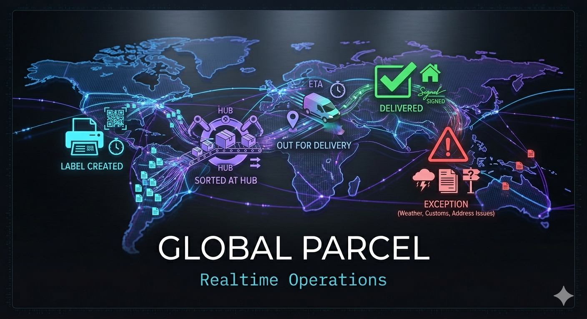
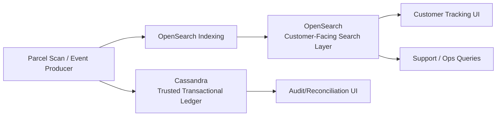
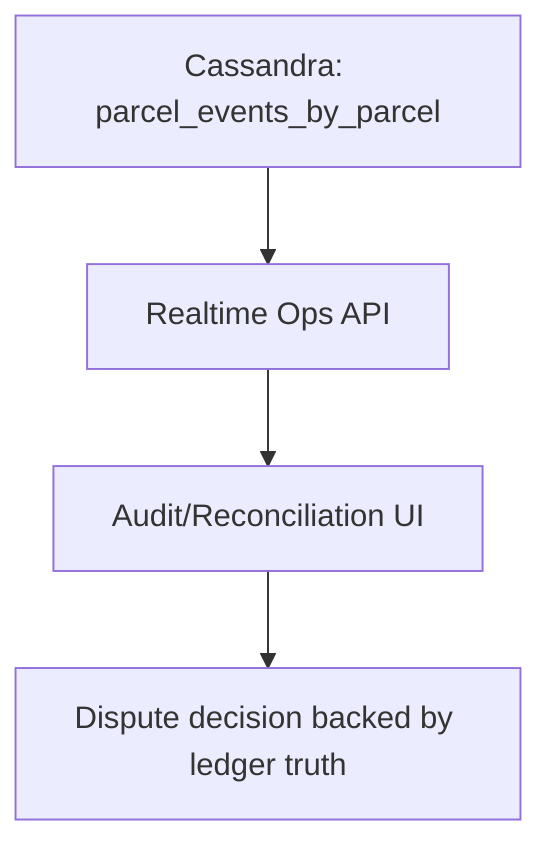
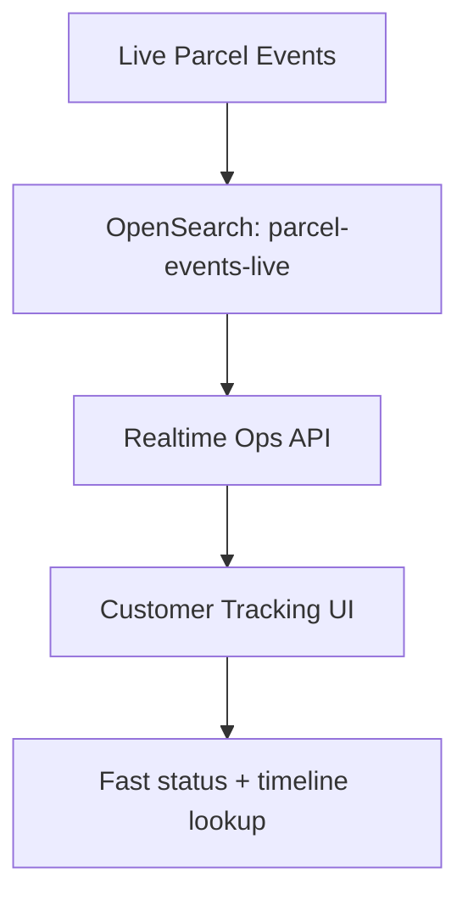

# Global Parcel - 02 Realtime operations

<p align="center">
  
</p>

This session expands the Global Parcel story into **transactional reliability at operational speed** on **IBM watsonx.data**, leveraging fit-for-purpose engines in one governed data platform:

- **DataStax HCD (based on Apache Cassandra)** as the **trusted transactional backend ledger**: always-on, unbreakable-by-design architecture, and linearly scalable high-throughput writes.
- **OpenSearch** as the **customer-facing tracking search frontend**: low-latency lookup for parcel status, timeline retrieval, and support/operations drill-down.

The goal is to show how teams can go from **parcel event transaction** to **customer experience update in milliseconds**, without sacrificing reliability as volume scales.

Using **watsonx.data** here matters because teams do not need to force every workload into one engine. They can keep transactional event durability and operational search in engines optimized for each job, while maintaining one platform-level governance and integration model.

---

## Session positioning

`01-data-federation` focused on governed historical and federated analytics.  
`02-realtime-operations` introduces the operational transaction layer and search layer.  
`03-accelerate-ai` will then consume these curated products for agentic workflows.

---

## Business case

Global Parcel is experiencing growth in parcel volume, regions, and service-level promises. Legacy operational patterns struggle with two opposing needs:

1. **Write every event fast and durably** (scan, handoff, delay, failed delivery, exception).
2. **Query current state flexibly** for contact-center, customer portal, and live operations.

### Why this matters now

- **Customer expectations:** "Where is my parcel?" must answer immediately and accurately.
- **Operational pressure:** dispatch teams need real-time exception visibility, not batch reports.
- **Growth risk:** startup/scale-up teams cannot repeatedly re-platform as volume increases.

### Value proposition of DataStax HCD + OpenSearch

- **DataStax HCD (based on Cassandra)** is the trusted, authoritative transaction ledger for parcel events, built for reliability and horizontal scale under sustained write load.
- **OpenSearch** is the customer-facing query layer that serves fast tracking/search experiences across parcel status, history, and exception views.
- Combined, they bridge the gap between **high-speed ingestion** and **deep query-ability**.
- **watsonx.data** provides the fit-for-purpose foundation: compose the right engine for each workload, avoid one-size-fits-all compromises, and keep architecture decisions aligned to business SLOs as you scale.

### Business outcomes for startups and scale-ups

- **Operational excellence from day one:** predictable write performance and resilience under burst traffic.
- **Faster issue resolution:** operations and support teams find delayed/at-risk shipments quickly.
- **Improved customer experience:** near real-time tracking updates reduce uncertainty and ticket volume.
- **Lower re-architecture risk:** architecture remains valid from MVP through multi-region growth.

---

## Use case: Transaction to customer experience in milliseconds

### Scenario

Each parcel emits events throughout its lifecycle:

- label created
- sorted at hub
- out for delivery
- delivered
- exception (weather, customs, address issues)

### Data flow pattern

1. Parcel event is written to **Cassandra** as the trusted transactional ledger and system of record.
2. Event is indexed to **OpenSearch** to power customer-facing tracking search and operational exploration.
3. Customer-facing APIs and support tools query OpenSearch for low-latency retrieval while Cassandra remains the authoritative durable write path.
4. Critical status transitions trigger downstream notification and SLA workflows.



### Personas and questions answered

- **Customer support:** "Show all parcels in Paris with delivery exceptions in the last 30 minutes."
- **Operations control tower:** "Which hubs are driving the highest delay growth this hour?"
- **Digital channel team:** "Return latest parcel status instantly for tracking UI."

---

## Demo goals

By the end of this session, participants should see:

1. **High-throughput transactional writes** into DataStax HCD (Cassandra).
2. **Sub-second investigative queries** in OpenSearch.
3. A full flow from **event ingestion -> indexing -> customer-visible status retrieval**.
4. A repeatable architecture blueprint suitable for startups and scale-ups.

---

## Hands-on Flow

Before running any steps, set your current working directory (CWD) to this session folder:

```bash
cd 02-realtime-operations
```

Activate the repository virtual environment:

```bash
source ../.venv/bin/activate
python --version
```

### Choose your pace

- **Live demo mode (15-20 minutes):** follow steps `1-3`, `6-11`, `13`, and `15` to show the full story quickly.
- **Self-paced mode:** run every numbered step and inspect intermediate outputs/queries.

### Fast path for live demo (15 minutes)

1. Start Cassandra, create schema/table, and seed static data.
2. Start API and show `/audit-ui/` with one seeded parcel (`PCL-000001`).
3. Start OpenSearch and stream with `--index-opensearch`.
4. Show OpenSearch `_count` growth and open `/customer-ui/` with `PCL-LIVE-000001`.

### Part 1 - Cassandra transactional ledger (authoritative backend)

For this workshop iteration, Cassandra is the transactional engine baseline.

1) Start Cassandra with Docker Compose:

```bash
docker compose up -d cassandra
docker compose ps # check for container startup
```

2) Confirm Cassandra is up:

```bash
docker compose logs cassandra -f
docker compose exec cassandra nodetool status
```

Expected checks:
- Node status is `UN` (Up/Normal)
- Datacenter is `globalparcel-dc1`

3) Create the session keyspace and table:

```bash
docker compose exec -T cassandra cqlsh <<'EOF'
CREATE KEYSPACE IF NOT EXISTS globalparcel_ops
WITH replication = {'class': 'SimpleStrategy', 'replication_factor': 1};

USE globalparcel_ops;

CREATE TABLE IF NOT EXISTS parcel_events_by_parcel (
  parcel_id text,
  event_ts timestamp,
  status text,
  hub_code text,
  region text,
  latitude double,
  longitude double,
  exception_code text,
  customer_eta timestamp,
  PRIMARY KEY ((parcel_id), event_ts)
) WITH CLUSTERING ORDER BY (event_ts DESC);
EOF
```

4) Install Python requirements for this session:

```bash
python -m pip install -r requirements.txt
```

5) Run the static dataset producer

```bash
python scripts/generate_parcel_events.py --parcels 60
```

This creates:
- `generated/parcel_events.csv` (easy to inspect)
- `generated/parcel_events_seed.cql` (ready for bulk load)

This dataset producer emits plausible multi-hop journeys across major parcel hubs (for example: Paris -> Frankfurt -> New York -> Chicago, or Tokyo -> Hong Kong -> Singapore -> Mumbai -> Dubai -> Paris) with consistent latitude/longitude values per event.

6) Bulk-load the static dataset into Cassandra:

```bash
docker compose exec -T cassandra cqlsh < generated/parcel_events_seed.cql
```

7) Run the Audit/Reconciliation dashboard (Cassandra source-of-truth):

```bash
uvicorn realtime_ops_api:app --app-dir backend --host 0.0.0.0 --port 8080
```

Open [http://localhost:8080/audit-ui/](http://localhost:8080/audit-ui/).

This dashboard demonstrates the **Cassandra source-of-truth read path** for dispute workflows.
Use it to validate what was actually written on the transactional timeline when customer-facing channels show stale or conflicting status.

What this view shows:

- **Dispute summary** (customer-visible status vs Cassandra latest status)
- **Audit integrity signals** for reconciliation decisions
- **Geo route map** from Cassandra event positions
- **Full Cassandra timeline** for the selected `parcel_id`

Now solve your dispute:

1. Enter a seeded parcel id (for example `PCL-000001`, `PCL-000017`, etc. from `generated/parcel_events.csv`) and load the timeline.
2. Compare **customer app status** with **Cassandra latest status** in the summary card.
3. Use the map + timeline to explain route progression and any exception event (look for `WX_DELAY` rows).
4. Close the dispute using Cassandra as the authoritative evidence trail.

> [!NOTE]
> The app is a demo environment, so not all functions are operable. Stick with searching for the Parcel ID.

Part 1 outcome: you can demonstrate dispute reconciliation entirely from Cassandra as the authoritative read path.



### Part 2 - OpenSearch customer-facing tracking search frontend

8) Start OpenSearch and OpenSearch Dashboards:

```bash
export OPENSEARCH_INITIAL_ADMIN_PASSWORD='GlobalParcel123!'
docker compose up -d opensearch opensearch-dashboards
docker compose ps
```

9) Confirm OpenSearch is up:

```bash
curl -s http://localhost:9200 | python -m json.tool
curl -s http://localhost:9200/_cluster/health | python -m json.tool
```

Expected checks:
- `version.number` is returned by the root endpoint
- Cluster health is `yellow` or `green` for single-node demo
- OpenSearch Dashboards is reachable at [http://localhost:5601](http://localhost:5601)

10) Create the OpenSearch index mapping for parcel events:

```bash
curl -s -X PUT "http://localhost:9200/parcel-events-live" \
  -H "Content-Type: application/json" \
  -d '{
    "settings": {
      "index": {
        "number_of_shards": 1,
        "number_of_replicas": 0
      }
    },
    "mappings": {
      "properties": {
        "parcel_id": { "type": "keyword" },
        "event_ts": { "type": "date" },
        "status": { "type": "keyword" },
        "hub_code": { "type": "keyword" },
        "region": { "type": "keyword" },
        "exception_code": { "type": "keyword" },
        "customer_eta": { "type": "date" },
        "geo_position": { "type": "geo_point" }
      }
    }
  }' | python -m json.tool
```

11) Start the live event producer (Cassandra write + OpenSearch indexing at ~10 events/sec):

```bash
python scripts/stream_parcel_events.py --events-per-second 10 --index-opensearch
```

Keep this running in one terminal. It continuously writes realistic parcel journey events to Cassandra and indexes the same events into OpenSearch.

12) Verify Cassandra load volume (from another terminal):

```bash
docker compose exec -T cassandra cqlsh <<'EOF'
USE globalparcel_ops;

SELECT COUNT(*) FROM parcel_events_by_parcel;
EOF
```

13) Verify OpenSearch indexing:

```bash
curl -s "http://localhost:9200/parcel-events-live/_count" | python -m json.tool
curl -s "http://localhost:9200/parcel-events-live/_search?size=3&sort=event_ts:desc" | python -m json.tool
```

13b) Import the prepared OpenSearch dashboard:

1. Open OpenSearch Dashboards at [http://localhost:5601](http://localhost:5601).
2. Go to **Management -> Stack Management -> Saved Objects -> Import**.
3. Import:
   - `opensearch-dashboards/globalparcel-ops-dashboard.ndjson`
4. Open dashboard:
   - **Global Parcel - Realtime Tracking Dashboard**

This dashboard gives a ready-made, customer-relevant tracking timeline over `parcel-events-live` so you can immediately demonstrate live status visibility and operational triage.

14) Query one sample parcel timeline in Cassandra:

```bash
docker compose exec -T cassandra cqlsh <<'EOF'
USE globalparcel_ops;

SELECT parcel_id, event_ts, status, hub_code, region, latitude, longitude, exception_code
FROM parcel_events_by_parcel
WHERE parcel_id = 'PCL-LIVE-000001';
EOF
```

When this query returns a multi-event timeline and OpenSearch `_count` is increasing, you are ready to continue using the same stream for the customer frontend on OpenSearch.

15) Open the customer tracking frontend (OpenSearch read path):

Reuse the API server from Part 1, or start it now if needed:

```bash
uvicorn realtime_ops_api:app --app-dir backend --host 0.0.0.0 --port 8080
```

Open [http://localhost:8080/customer-ui/](http://localhost:8080/customer-ui/) and track a live parcel id such as `PCL-LIVE-000001`.

This view demonstrates OpenSearch as the customer-facing tracking/search frontend, while the audit dashboard at [http://localhost:8080/audit-ui/](http://localhost:8080/audit-ui/) demonstrates Cassandra as the trusted transactional ledger backend and source-of-truth reconciliation path.



---

## Handoff to session 03

You now have both sides of the Global Parcel story:
- **governed historical + surcharge context** (session 01)
- **live operational tracking + exceptions** (this session)

Continue with [`../03-accelerate-ai/README.md`](../03-accelerate-ai/README.md) to layer agentic workflows on top of these signals.