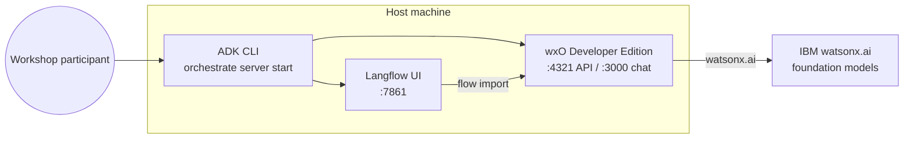

# Global Parcel - Accelerate AI Demo Spec

## 1) Demo title

**From Operational Signals to Agentic Answers**  
Global Parcel insights with watsonx Orchestrate ADK and Langflow

---

## 2) Objective

Demonstrate how Global Parcel can:

1. Run **watsonx Orchestrate Developer Edition** locally via the **ADK CLI** with **user-managed Docker** on Linux (not QEMU/Lima).
2. Build a **Langflow** workflow for parcel and logistics Q&A.
3. Connect that flow to **watsonx Orchestrate** and chat through the local UI.

---

## 3) Audience

- Platform and integration engineers evaluating agentic layers on curated data products
- Workshop participants who completed sessions 01 (federation) and 02 (realtime ops)
- Architects comparing low-code flows (Langflow) with governed orchestration (wxO)

---

## 4) Scope and non-goals

### In scope

- ADK install (`ibm-watsonx-orchestrate`)
- **Linux:** `orchestrate settings docker host --user-managed` + Docker Engine (no QEMU)
- Developer Edition server with `--with-langflow`
- Local chat UI (`orchestrate chat start`)
- Langflow flow creation and import into wxO (JSON or MCP)
- Optional sample agent import (`agents/parcel_assistant.yml`)

### Out of scope

- Manual QEMU/Lima setup (use user-managed Docker on Linux instead)
- Production SaaS deployment
- Full RAG over live Cassandra/OpenSearch endpoints (extension exercise)

---

## 5) Architecture overview



---

## 6) Live demo path (15–20 minutes)

| Step | Action | Success check |
| --- | --- | --- |
| 1 | `pip install -r requirements.txt` | `orchestrate --version` prints a 2.x version |
| 2 | Configure `03-accelerate-ai/.env` | Auth method variables set (myIBM or SaaS) |
| 3 | `orchestrate server start -e .env --with-langflow` | API docs at `http://localhost:4321/docs` |
| 4 | `orchestrate env activate local` + `orchestrate agents import -f agents/ask_orchestrate.yml` | `orchestrate agents list` shows AskOrchestrate on `granite-3-8b-instruct` |
| 5 | `orchestrate chat start` | Browser opens `http://localhost:3000/chat-lite` |
| 6 | Open Langflow at `http://localhost:7861`, build a simple chat flow | Flow runs in Langflow playground |
| 7 | Import Cassandra ledger tools + Langflow customer flow + `parcel_assistant` | `orchestrate tools list` shows ledger + `Parcel OpenSearch Customer` |
| 8 | Import flow to wxO (`orchestrate tools import -k langflow -f ...`) | Langflow tool calls `/api/customer/{parcel_id}` only |
| 9 | Chat with Parcel Assistant | Agent uses Langflow for customer view, Cassandra tools to reconcile |

### Suggested demo prompts

- "What data products did we build in sessions 01 and 02 for Global Parcel?"
- "What is the latest status of PCL-000001 according to the Cassandra ledger?"
- "What delivery notes are on the ledger for PCL-000001?"
- "Customer claims NOT DELIVERED for PCL-LIVE-000001 — what does customer tracking show, and reconcile against the ledger (quote driver notes)."
- "Summarize the value of combining lakehouse history with realtime parcel events."

---

## 7) Ports reference

| Service | URL |
| --- | --- |
| wxO API | http://localhost:4321 |
| wxO OpenAPI docs | http://localhost:4321/docs |
| wxO chat UI | http://localhost:3000/chat-lite |
| Langflow (ADK) | http://localhost:7861 |

---

## 8) Reset and cleanup

```bash
orchestrate chat stop
orchestrate server stop
orchestrate server reset -e .env   # removes dev-edition containers + volumes
```

On **user-managed Docker** (this lab), use `reset` — not `purge`. `orchestrate server purge` only applies to the Lima/QEMU VM install path.

If you previously used pre-2.0 Docker Compose installs, `reset` is usually enough; switch to user-managed Docker before the next `server start`.
