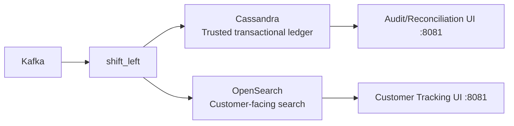

# 03 — Operate the business 📍

<p align="center">
  
</p>

Part of the **[StreamHouse workshop](../README.md)** — the **operate** chapter: **Cassandra (DataStax HCD)** as the parcel ledger and **OpenSearch** as customer tracking search.

The transform in chapter 01 already lands every scan in both engines. This chapter **runs** those products: customer tracking on search, audit on the ledger.

Work from **this directory**. Keep `PYTHONPATH=.`. Use the workshop venv from the parent folder (`source ../.venv/bin/activate`) — FastAPI and the engine clients were installed in chapter 01. Leave chapter 01 Compose (Cassandra, OpenSearch) and the shift-left job running.

- **DataStax HCD (based on Apache Cassandra)** as the **trusted transactional backend ledger**: always-on, unbreakable-by-design architecture, and linearly scalable high-throughput writes.
- **OpenSearch** as the **customer-facing tracking search frontend**: low-latency lookup for parcel status, timeline retrieval, and support/operations drill-down.

The goal is to show how teams can go from **parcel event transaction** to **customer experience update in milliseconds**, without sacrificing reliability as volume scales.

You do not force every workload into the lakehouse. Ledger and search stay in engines built for those jobs; watsonx.data stays the governed SQL plane.

---

## Business case

Global Parcel is experiencing growth in parcel volume, regions, and service-level promises. Legacy operational patterns struggle with two opposing needs:

1. **Write every event fast and durably** (scan, handoff, delay, failed delivery, exception).
2. **Query current state flexibly** for contact-center, customer portal, and live operations.

### Why this matters now

- **Customer expectations:** "Where is my parcel?" must answer immediately and accurately.
- **Operational pressure:** dispatch teams need real-time exception visibility, not batch reports.
- **Growth risk:** startup/scale-up teams cannot repeatedly re-platform as volume increases.

### Value proposition of DataStax HCD + OpenSearch

- **DataStax HCD (based on Cassandra)** is the trusted, authoritative transaction ledger for parcel events, built for reliability and horizontal scale under sustained write load.
- **OpenSearch** is the customer-facing query layer that serves fast tracking/search experiences across parcel status, history, and exception views.
- Combined, they bridge the gap between **high-speed ingestion** and **deep query-ability**.
- **watsonx.data** provides the fit-for-purpose foundation: compose the right engine for each workload.



---

## Hands-on

### 1. Confirm the engines 🔎

From **`01-streamhouse/`** (Compose still up):

```bash
docker compose exec -T cassandra cqlsh -e "SELECT COUNT(*) FROM globalparcel_ops.parcel_events_by_parcel;"
curl -s "http://localhost:9200/parcel-events-live/_count"
```

You should see counts growing while `transform.shift_left` runs.

### 2. Run the ops apps 🖥️

From **this directory**:

```bash
PYTHONPATH=. uvicorn apps.api:app --host 0.0.0.0 --port 8081
```

One process on `:8081` serves both UIs and their JSON. Details: [`apps/README.md`](apps/README.md).

| You want to show | Open | Reads |
| --- | --- | --- |
| Customer “where is my parcel?” | http://localhost:8081/customer-ui/ | **OpenSearch** |
| Dispute / source of truth | http://localhost:8081/audit-ui/ | **Cassandra** |

The control tower stays on [http://localhost:8088/tower/](http://localhost:8088/tower/).

### 3. Customer tracking (OpenSearch) 📦

Open [http://localhost:8081/customer-ui/](http://localhost:8081/customer-ui/) and track `PCL-LIVE-000001`.

This view is what the customer sees. It does **not** expose driver notes — those stay on the ledger for the agent chapter.

### 4. Audit / reconciliation (Cassandra) ⚖️

Open [http://localhost:8081/audit-ui/](http://localhost:8081/audit-ui/).

This dashboard is the **Cassandra source-of-truth read path** for dispute workflows.

1. Load `PCL-000001` (replayed history) or `PCL-LIVE-000001` (live).
2. Compare **customer app status** with **Cassandra latest status**.
3. Use the map + timeline; look for `WX_DELAY` and **delivery driver notes**.
4. Close the dispute using Cassandra as the authoritative evidence trail.

```bash
# from 01-streamhouse/
docker compose exec -T cassandra cqlsh <<'EOF'
USE globalparcel_ops;
SELECT parcel_id, event_ts, status, hub_code, region, delivery_note
FROM parcel_events_by_parcel
WHERE parcel_id = 'PCL-000001';
EOF
```

### 5. OpenSearch Dashboards 📊

1. Open [http://localhost:5601](http://localhost:5601).
2. **Management → Stack Management → Saved Objects → Import**.
3. Import `opensearch-dashboards/globalparcel-ops-dashboard.ndjson`.
4. Open **Global Parcel - Realtime Tracking Dashboard**.

---

## Delivery driver notes

**Delivery driver notes** are short field messages left at each scan. They live on the **Cassandra ledger**. Agents in the next chapter quote them for delays, disputes, or proof of delivery. The customer OpenSearch index exposes status and timeline only.

| Store | `delivery_note` |
| --- | --- |
| **Cassandra ledger** | Yes — every scan |
| **OpenSearch** `parcel-events-live` | No |
| **Audit UI** | Yes (timeline) |

Example notes:

- `Sorted into outbound lane at FRA-01; cage GP-412.`
- `Weather delay — ramp closed for de-icing; customer ETA may slip.`
- `Delivered at Chicago; signed by recipient.`

Continue with [`../04-accelerate-ai/README.md`](../04-accelerate-ai/README.md).
