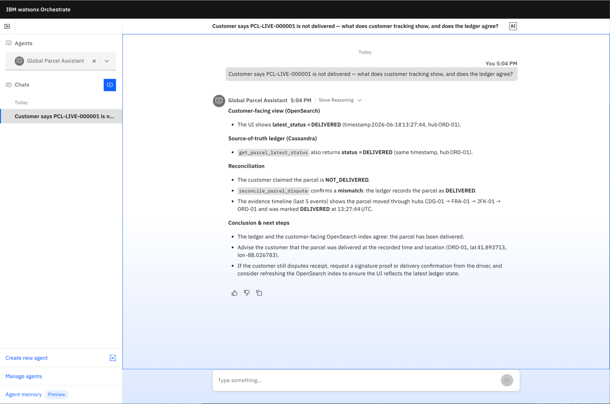
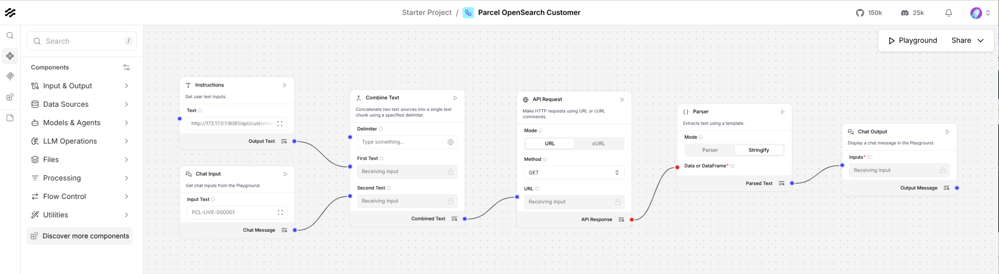
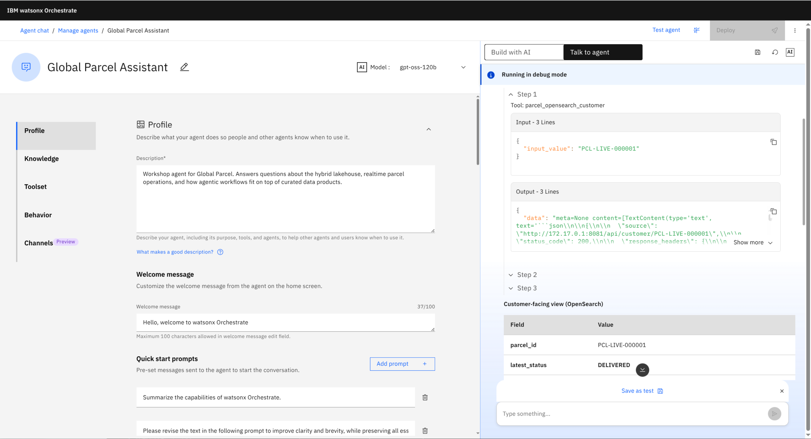
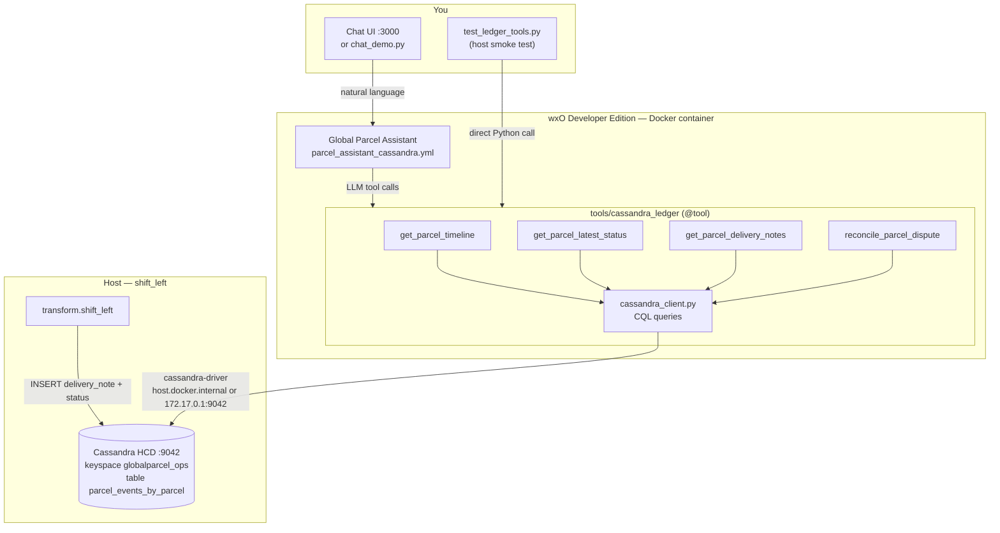
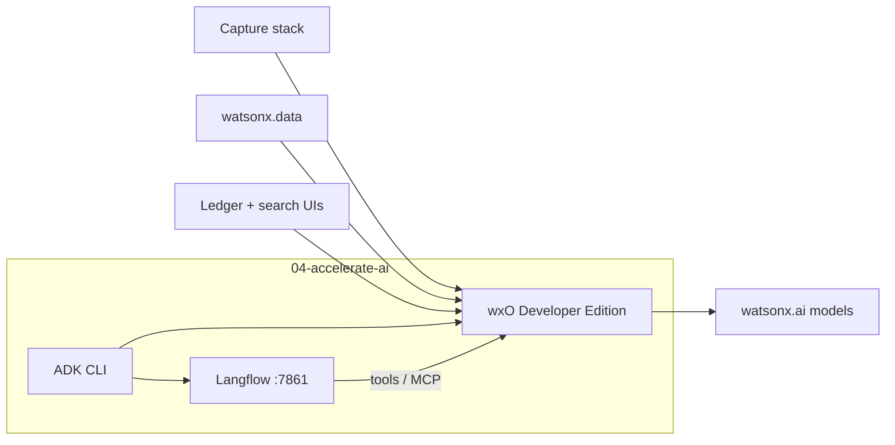
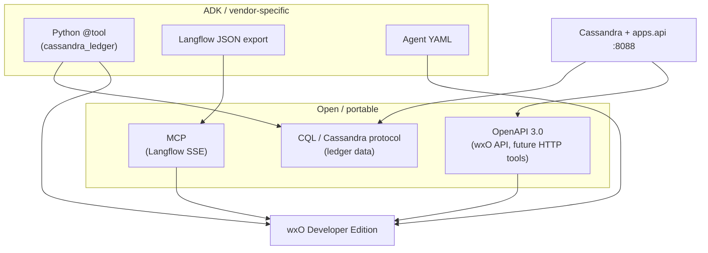

# Global Parcel — Accelerate AI with watsonx Orchestrate

[](https://www.ibm.com/products/watsonx-orchestrate)
[](https://www.langflow.org/)
[](https://www.datastax.com/products/datastax-hcd)
[](https://cassandra.apache.org/)
[](https://opensearch.org/)

Part of the **[StreamHouse workshop](../README.md)** — the **ask** chapter: **watsonx Orchestrate** and **Langflow** on the same ledger and customer API.

Same parcels, now with an agent: ADK locally, Langflow as an MCP tool, chat on the captured business.





---

## Where this sits in the workshop

| Chapter | Capability |
| --- | --- |
| **01 — Capture** | Kafka, shift-left into Cassandra + OpenSearch + Iceberg, apps `:8088` |
| **02 — Query** | Iceberg history + federated Kafka `fuel.surcharge` in watsonx.data |
| **03 — Operate** | Ledger vs customer search (audit UI, tracking UI, Dashboards) |
| **04 — Ask** | ADK + Langflow + local Developer Edition |

---

## What you will do

1. Install the **ADK** (`ibm-watsonx-orchestrate`) in the repo Python environment.
2. Start **Developer Edition** with Langflow: `orchestrate server start -e .env --with-langflow`.
3. Open the **chat UI** and **Langflow editor**.
4. Import a Langflow flow as a wxO tool and chat with an agent.

---

## Prerequisites

| Requirement | Notes |
| --- | --- |
| **Python 3.11–3.13** | IBM-tested range; 3.14 may break bundled Lima binaries |
| **Docker** | By default Ochestrate uses Qemu and Lima for virtualization. You can bypass it to use your own preference, or when on Linux |
| **16 GB RAM** | 32 GB recommended with Langflow |
| **Credentials** | myIBM entitlement + watsonx.ai API key + deployment space ID, **or** a watsonx Orchestrate SaaS instance |
| **Capture still up** | Cassandra `:9042`, OpenSearch `:9200`, API on `:8088` — see **[delivery driver notes](../03-realtime-operations/README.md#delivery-driver-notes)** |

On **Linux**, the ADK defaults to a **Lima + QEMU** VM. This lab uses your **native Docker Engine** instead — no QEMU.

Official references:

- [Installing the ADK](https://developer.watson-orchestrate.ibm.com/getting_started/installing)
- [Developer Edition setup (Docker)](https://developer.watson-orchestrate.ibm.com/developer_edition/wxOde_setup_legacy)
- [Langflow + wxO tutorial](https://www.ibm.com/think/tutorials/build-custom-ai-agents-with-langflow)

---

## Working directory

```bash
cd 04-accelerate-ai
```

Activate the repository virtual environment:

```bash
source ../.venv/bin/activate
python --version   # expect 3.11+
```

---

## Hands-on flow

### 1a) Linux (or self managed Container-VM): use Docker Engine, not QEMU/Lima

The ADK **defaults to Lima + QEMU on Linux**. You can also witch to user-managed Docker **once** before your first `server start` (useful on Linux):

```bash
pip install -r requirements.txt
orchestrate settings docker host --user-managed
```

### 1b) Install the ADK

```bash
pip install -r requirements.txt
orchestrate --version
```

### 2) Configure credentials

```bash
cp .env.example .env
```

Edit `.env` and set **one** authentication method:

**myIBM (typical for workshops)**

```bash
WO_DEVELOPER_EDITION_SOURCE=myibm
WO_ENTITLEMENT_KEY=<from myibm.ibm.com container library>
WATSONX_APIKEY=<IBM Cloud API key>
WATSONX_SPACE_ID=<watsonx.ai deployment space GUID>
WATSONX_URL=https://us-south.ml.cloud.ibm.com
```

**watsonx Orchestrate SaaS / trial**

```bash
WO_DEVELOPER_EDITION_SOURCE=orchestrate
WO_INSTANCE=<service instance URL from wxO Settings → API details>
WO_API_KEY=<generated API key>
```

Embedded service credentials in `.env.example` include a **workshop default** for `DB_ENCRYPTION_KEY` (32-char hex). To generate your own: `openssl rand -hex 16`.

### 3) Start Developer Edition with Langflow

```bash
orchestrate server start -e .env --with-langflow
```

First start can take several minutes. When ready you should see:

- API: http://localhost:4321 (OpenAPI docs: `/docs`, spec: `/api/openapi.json`)
- Langflow: http://localhost:7861

```bash
curl -s -o /dev/null -w "%{http_code}\n" http://localhost:4321/docs
```

### 4) Activate the local environment

```bash
orchestrate env activate local
orchestrate env list
```

List the available models:

```bash
orchestrate models list -a
```

Now set a **supported default model** for the tenant:

```bash
orchestrate models config default -n watsonx/ibm/granite-4-h-small
```

**Fix AskOrchestrate** (the default chat agent ships with a removed Llama model — tenant default does not override per-agent LLM):

```bash
orchestrate agents import -f agents/ask_orchestrate.yml
orchestrate agents list    # AskOrchestrate should show granite-3-8b-instruct
```

> [!TIP]
> Refresh the chat UI (`orchestrate chat stop` then `orchestrate chat start`) when changing the model once the Agent started.

### 5) Start the chat UI

```bash
orchestrate chat start
```

Opens **http://localhost:3000/chat-lite** in your browser. Try out some simple questions that don't require parcel data (as no tools have been added yet).

### 6) Cassandra ledger tools

Connection defaults (CQL port, keyspace, Linux `CASSANDRA_HOST`): **[delivery driver notes](../03-realtime-operations/README.md#delivery-driver-notes)**.

Each scan stores a **delivery driver note** on the ledger (`delivery_note`). Agents quote them for delays and disputes — the customer OpenSearch view does not expose them.



With Cassandra running (`PCL-000001`, `PCL-LIVE-000001`), smoke-test against local Cassandra (host, not wxO container):

```bash
CASSANDRA_HOST=127.0.0.1 python scripts/test_ledger_tools.py PCL-000001
```
> [!TIP]
> On Linux, wxO tools reach host Cassandra via `host.docker.internal`; if that fails, set `CASSANDRA_HOST=172.17.0.1` before import. See **[tools/README.md](tools/README.md)**.

First let's ensure no tools are available yet:

```bash
orchestrate tools list
```

Now import the Python tools into Orchestrate that read the authoritative ledger:

```bash
PKG=tools/cassandra_ledger
orchestrate tools import -k python -p "$PKG" -f "$PKG/get_parcel_timeline.py" -r "$PKG/requirements.txt"
orchestrate tools import -k python -p "$PKG" -f "$PKG/get_parcel_latest_status.py" -r "$PKG/requirements.txt"
orchestrate tools import -k python -p "$PKG" -f "$PKG/get_parcel_delivery_notes.py" -r "$PKG/requirements.txt"
orchestrate tools import -k python -p "$PKG" -f "$PKG/reconcile_parcel_dispute.py" -r "$PKG/requirements.txt"
orchestrate agents import -f agents/parcel_assistant_cassandra.yml
```

First let's check the tools again:
```bash
orchestrate tools list
```

Now run these example chat prompts in the [watsonx Orchestrate UI](http://localhost:3000/chat) (select **Global Parcel Assistant** Agent):

- “What is the latest status of PCL-000001 in the ledger?”
- “What delivery notes did drivers leave for PCL-000001?”
- “Reconcile a dispute, customer claims NOT DELIVERED for PCL-000001 — quote the latest driver note.”
- "What does the customer ui say?"

For the last question, you'll see that we don't truly have a single pane of glass yet. This is holding back our employees efficiency. So let's fix that in the later steps.

### 7) Quick chat demo (CLI)
At this point, you've imported the agents and tools and have the backend services running. Here's what is happening across steps 6 and 7, and what you're testing:

- **Cassandra tools**: Python scripts and imported Orchestrate tools interact directly with your transactional ledger. These answer questions about parcel status from a trusted, source-of-truth database.
- **Agent import**: Now, the "Global Parcel Assistant" agent (`parcel_assistant_cassandra.yml`) is ready in Orchestrate. This agent can invoke the Cassandra tools automatically as part of its workflow.
- **Demo prompts**: The sample chat prompts exercise both the Cassandra tools (for official status) and begin to highlight the need for reconciliation with customer-facing sources.

When you run:
```bash
python scripts/chat_demo.py --question "Reconcile a dispute, customer claims NOT DELIVERED for PCL-000001."
```
you're simulating a chat interaction—just like in the UI—where the agent processes a natural language question and calls the required tools behind the scenes.

**Interactive mode** (`--interactive`) lets you try your own real-world questions, confirming that orchestration and tool-calling are working end-to-end.

```bash
python scripts/chat_demo.py --interactive
```

### 8) Langflow MCP server for reconciliation with Customer UI

**Split responsibilities:** Langflow reads the **OpenSearch customer API** (what `/customer-ui/` shows). **Cassandra ledger tools** (step 6) handle reconciliation.

Host/API URLs and Docker bridge settings: **[delivery driver notes](../03-realtime-operations/README.md#delivery-driver-notes-session-04)** (use `172.17.0.1:8088` for Langflow on Linux).

With the StreamHouse API running from `01-streamhouse/` (`PYTHONPATH=. uvicorn apps.api:app … --port 8088`) and OpenSearch indexed:

1. Import `tools/langflow/parcel_opensearch_customer.json` at **http://localhost:7861** (optional: test playground with `PCL-LIVE-000001`)
2. Click "Share → MCP Server" and ensure "PARCEL_OPENSEARCH_CUSTOMER" is set under `Flows/Tools` (optional: click JSON to understand how to call the MCP server)
3. Make note of the URL inside the `args` sections, as you'll need it below

> [!INFO]
> Langflow playground calls `GET /api/customer/{parcel_id}` — no LLM required

Now we're ready to add this MCP tool to Orchestrate.
1. Ensure you replace the placeholder with the URL for the MCP server
2. Ensure to use `host.docker.internal` as we're in a dockerized environment

```bash
orchestrate toolkits add \
  --kind mcp \
  --name langflow_parcel_mcp \
  --description "Langflow MCP for Global Parcel" \
  --command "uvx mcp-proxy http://host.docker.internal:7861/api/v1/mcp/project/38a0dc38-8574-423f-b902-c9b5d6323eba/sse" \
  --tools "*"
```

To list the tools available:

```bash
orchestrate tools list
```

And finally update the agent so it's aware to use the new LangFlow MCP tool:

```bash
orchestrate agents import -f agents/parcel_assistant_opensearch.yml
orchestrate chat stop
orchestrate chat start
```

Navigate to the Orchestrate UI at http://localhost:3000/chat and ask:

> Customer says PCL-LIVE-000001 is not delivered — what does customer tracking show, does the ledger agree, and what do the driver notes say?

---

## Architecture



---

## Open standards and tool formats

This session mixes **open, portable interfaces** with **ADK- and vendor-specific packaging**. Both are intentional: open standards ease integration and handoff; ADK-native formats are fastest for a local workshop.

| Piece in this lab | Format | Open standard? | Notes |
| --- | --- | --- | --- |
| **wxO REST API** | [OpenAPI 3.0](https://developer.watson-orchestrate.ibm.com/apis/auth/login-for-token) | Yes | Spec at `http://localhost:4321/api/openapi.json`; used by `chat_demo.py` |
| **Chat completions** | `POST /api/v1/orchestrate/{agent_id}/chat/completions` | De facto (OpenAI-style) | Common pattern for agent chat; not a formal ISO standard |
| **MCP toolkits** (step 8) | [Model Context Protocol](https://modelcontextprotocol.io/) | Yes | Langflow → wxO via SSE; good when you want a portable agent–tool wire protocol |
| **OpenAPI tools** | `orchestrate tools import -k openapi` | Yes | Wrap existing HTTP APIs (e.g. StreamHouse `apps.api` on `:8088`) without custom Python |
| **Cassandra ledger tools** (step 6) | `orchestrate tools import -k python` + `@tool` | **No** (ADK format) | Data access uses standard **CQL** / Cassandra native protocol; tool definition is wxO-specific |
| **Langflow flow import** | `orchestrate tools import -k langflow` + exported JSON | **No** | Langflow-specific export; fine for quick demos |
| **Agents** | `agents/*.yml` (`spec_version: v1`) | **No** | wxO ADK agent definition |

### What we use in this repo



- **Step 6 (Cassandra ledger):** Python ADK tools for the **authoritative ledger** and reconciliation.
- **Step 8 (Langflow):** Langflow JSON calls **`GET /api/customer/{parcel_id}`** (OpenSearch customer UI path) only; pair with step 6 tools for disputes.
- **CLI chat (`chat_demo.py`):** Calls the wxO **OpenAPI-documented** REST surface.

### Choosing a format

| Goal | Prefer |
| --- | --- |
| Read the Cassandra ledger from a workshop agent | Python `@tool` (current `tools/cassandra_ledger/`) |
| Expose an existing REST API to agents | **OpenAPI** import against StreamHouse `apps.api` (`:8088`) |
| Connect Langflow with minimal lock-in | **MCP** (`orchestrate toolkits add --kind mcp`) |
| Fastest Langflow demo | Langflow JSON (`-k langflow`) |

See [Authoring OpenAPI tools](https://developer.watson-orchestrate.ibm.com/tools/create_openapi_tool) and [Authoring Python tools](https://developer.watson-orchestrate.ibm.com/tools/create_tool) in the ADK docs.

---

## Stop and clean up:

```bash
orchestrate chat stop
orchestrate server stop          # stop containers
```

Full reset (removes `dev-edition_*` containers and volumes — use after env/DB issues):

```bash
orchestrate server reset -e .env
```

`orchestrate server purge` **does not work** with user-managed Docker (`Cannot delete VM host…`). Use `reset` instead. `purge` is only for the Lima/QEMU install path.

---

## Demo script

Facilitators: see **[DEMO_SPEC.md](DEMO_SPEC.md)** for timing, prompts, and success checks.

---

## Next steps

- Add StreamHouse HTTP endpoints as **OpenAPI tools** (see [Open standards and tool formats](#open-standards-and-tool-formats)) — e.g. `/api/audit/{parcel_id}` and `/api/customer/{parcel_id}` from `apps.api`.
- Deploy agents to **watsonx Orchestrate SaaS** with `orchestrate env add` and `orchestrate agents import`.
- Explore observability: `orchestrate server start -e .env --with-langflow --with-langfuse`.

---

## License and support

Developer Edition is for local development. See [IBM watsonx Orchestrate documentation](https://developer.watson-orchestrate.ibm.com/) for production licensing and support.
