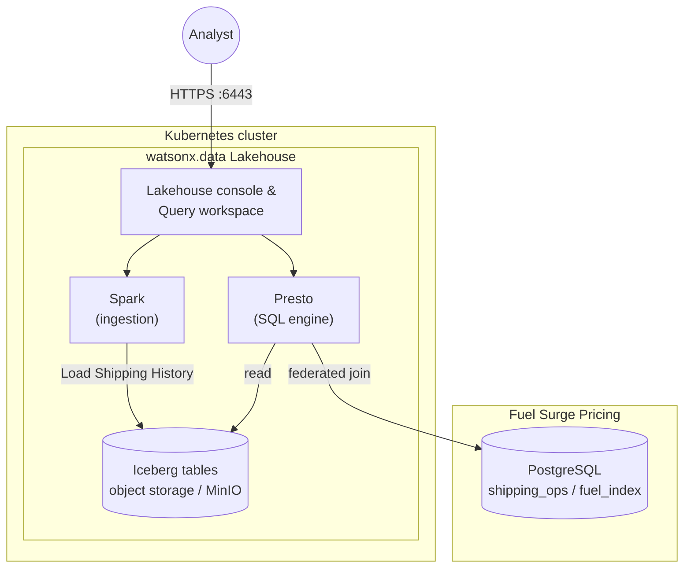

# Global Parcel Hybrid Lakehouse Demo

Global Parcel is looking to regain control over their data in order to address sovereignty concerns. In parallel they need to navigate the turmoil in the world with increasing fuel prices. They turn to watsonx.data for a solution.


## About this demo

The team keeps historical parcel events in lakehouse storage and combines them with live fuel surcharge data from PostgreSQL to calculate real invoice impact.

You will reproduce that flow end-to-end on a local Kind cluster.



This repository is a follow-along demo for running **IBM watsonx.data** locally and walking through a realistic Global Parcel use case:

- Ingest shipping history into Iceberg
- Query operational insights with Presto
- Federate that data with external PostgreSQL fuel surcharge data

## Prerequisites

- Windows, Mac or Linux host with Docker Engine
- `kubectl`
- `helm`
- `kind`
- Python (for data generation scripts)

## 1) 🧰 Install Tooling
The below commands are for a Fedora Linux workstation. Please use your equivalents on other environments.

This demo runs on a local Kubernetes environment, so you first need the standard cluster tooling:
- `kubectl` to inspect and troubleshoot cluster resources.
- `helm` to install watsonx.data charts and dependencies.
- `kind` to run Kubernetes locally in Docker.

If SELinux blocks local container or volume behavior in your environment, set it to permissive temporarily for the installation step.

### Install kubectl
```bash
sudo dnf install kubernetes-client
```

### Install Helm
```bash
sudo dnf install helm
```

### Install Kind
```bash
curl -Lo ./kind https://kind.sigs.k8s.io/dl/v0.31.0/kind-linux-amd64
chmod +x ./kind
sudo mv ./kind /usr/local/bin/kind
```

### Set SELinux permissive (if required for your setup)
```bash
sudo setenforce 0
```

## 2) ☸️ Create and validate Kind (K8s) cluster

This step creates the local Kubernetes control plane that hosts watsonx.data. Before installing anything, confirm core system pods are healthy so later failures are easier to isolate.

### Create Kind cluster
```bash
kind create cluster --name wxd
```

### Check Kubernetes readiness
```bash
watch kubectl get pods -n kube-system -o wide
```

### Optional host readiness check
```bash
./host_readiness.sh
```

The readiness script performs quick host-level checks (for example, binaries, connectivity, and basic runtime prerequisites) to catch local setup issues early.

## 3) 🚀 Install watsonx.data

Official watsonx.data installation docs: [Installing watsonx.data](https://www.ibm.com/docs/en/watsonxdata/standard/2.3.x?topic=version-installing)

```bash
cd watsonx.data-developer-edition-installer
helm dependency update
helm upgrade --install wxd . \
  -f values.yaml \
  -f values-secret.yaml \
  --namespace wxd \
  --create-namespace \
  --timeout 10m
```

### Check watsonx.data readiness
```bash
watch kubectl get pods -n wxd
```

### Port-forward required services
```bash
nohup kubectl port-forward -n wxd service/lhconsole-ui-svc 6443:443 --address 0.0.0.0 2>&1 &
nohup kubectl port-forward -n wxd service/ibm-lh-minio-svc 9001:9001 --address 0.0.0.0 2>&1 &
nohup kubectl port-forward -n wxd service/ibm-lh-mds-thrift-svc 8381:8381 --address 0.0.0.0 2>&1 &
```

## 4) 📦 Follow-Along: Shipping History

When energy markets swing and supply chains are stressed, carriers face higher fuel and operating costs—and those increases eventually show up in shipping rates and service levels. Understanding **where** shipments are delayed and **what** base shipping costs look like by origin helps Global Parcel explain trends to customers and plan before surcharges and delays hit the invoice. This step loads parcel history so you can analyze volume, delays, and average cost as the operational baseline.

### Generate sample shipping history
```bash
python 01_generate_shipping_history.py
```

### Load CSV into watsonx.data
1. Open `https://localhost:6443/` and sign in (`ibmlhadmin` / `password`).
2. Go to `Infrastructure manager` -> `Add component`.
3. Select `IBM Spark`, click `Next`.
4. Set display name (for example `spark-01`) and associate catalog `iceberg_bucket`.
5. Go to `Data manager` -> `iceberg_data` -> menu (`...`) -> `Create schema`.
6. Name schema `shipping`.
7. Under `iceberg_bucket`, use menu (`...`) -> `Create table from ...`.
8. Select generated `shipping_history.csv`.
9. Set target table name `shipping`, pick Spark engine, click `Done`.

### Query delayed shipments
In `Query workspace`, run:

```sql
SELECT origin_city, COUNT(*) AS volume, AVG(shipping_cost) AS avg_cost
FROM iceberg_data.shipping.shipping
WHERE status = 'Delayed'
GROUP BY origin_city
ORDER BY volume DESC;
```

## 5) ⛽ Follow-Along: Add Fuel Surcharge Data (PostgreSQL)

Fuel surcharges are how carriers pass through volatile diesel and energy costs: when crude prices spike or regional markets tighten—often amplified by geopolitical turmoil and broader uncertainty—surcharges move quickly, while published base rates may lag. Customers ultimately pay **base rate + surcharge** on each shipment. Federating live surcharge data with parcel history lets you see the **total invoice impact** by region instead of guessing from static list prices alone.

### Start PostgreSQL
```bash
docker run --name shipping-postgres \
  -e POSTGRES_PASSWORD=postgres \
  -e POSTGRES_DB=shipping_ops \
  -p 5432:5432 \
  -d postgres:latest
```

Get a connection string usable from watsonx.data:

```bash
printf 'postgresql://postgres:postgres@%s:5432/shipping_ops\n' "$(hostname -I | awk '{print $1}')"
```

### Generate and load fuel data
```bash
python 06_generate_fuel_data.py
```

### Add PostgreSQL as a federated source
1. Go to `Infrastructure manager` -> `Add component`.
2. Select `PostgreSQL`.
3. Enter:
   - Display name: `Fuel surge pricing`
   - Database name: `shipping_ops`
   - Hostname: your host IP from command above
   - Port: `5432`
   - Username: `postgres`
   - Password: `postgres`
4. Click `Test connection`.
5. Enable `Associate catalog`.
6. Name catalog `fuel_index`.
7. Click `Create`.

### Associate catalog with Presto
In `Infrastructure manager`, hover catalog -> `Manage associations` -> select Presto -> `Save and restart engine`.

### Query combined shipping + fuel surcharge impact
```sql
SELECT
  s.package_id,
  s.region,
  s.shipping_cost AS base_rate,
  f.fuel_surcharge,
  (s.shipping_cost + f.fuel_surcharge) AS total_invoice
FROM iceberg_data.shipping.shipping s
JOIN fuel_prices.public.fuel_index f ON s.region = f.region
LIMIT 10;
```

## 🥇 Recap: what we learned and why it matters

**What you walked through:** You stored parcel shipping history in an **Iceberg**-backed lakehouse, explored delays and cost patterns with **Presto**, and **federated** that history with live fuel surcharge rows in **PostgreSQL**—so a single query could express **total invoice impact** (base rate plus regional surcharge), not just one side of the story.

**Why that matters:** When energy and logistics costs are volatile, customers and finance teams need answers tied to **actual billable totals**, not siloed tables. Combining governed historical events with current surcharge data supports planning, pricing conversations, and operational transparency without re‑ETLing everything whenever fuel indices change.

**Hybrid and open:** **watsonx.data** fits this pattern by design: a **hybrid** lakehouse lets you keep authoritative parcel history in open table formats on object storage while **joining** systems of record (here, PostgreSQL) where they already live. That openness—**Apache Iceberg**, **Presto**-class SQL engines, and standard connectivity to databases you control—helps teams **keep data where policy requires**, avoid lock‑in, and run analytics **on premises or in a region you choose**, which directly addresses **data sovereignty** and residency worries that come with shipping sensitive operational data to opaque or distant clouds alone.

## Operations

### Pause or resume local cluster
```bash
docker stop wxd-control-plane
docker start wxd-control-plane
```

### Tear down everything
```bash
kind delete cluster --name wxd
docker system prune -a
```