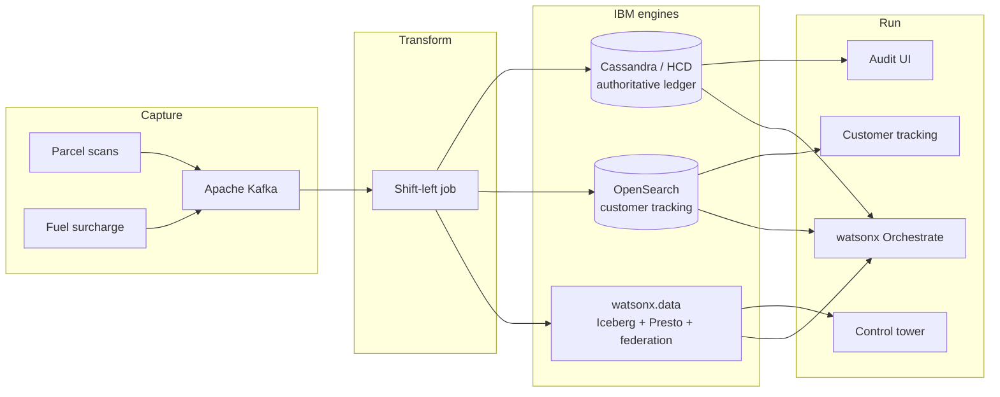

# Global Parcel StreamHouse

**Capture the business. Run the business.**

Shaun Clowes introduced StreamHouse as a simple idea: continuously **capture**, **transform**, and **query** real-time data so the company is looking at a **current view of the business**.

This workshop makes that idea concrete through a realistic Global Parcel scenario — and through the **IBM watsonx.data** vision: one platform, **fit-for-purpose engines**. You still build it yourself.


```mermaid
flowchart LR
    subgraph capture [Capture]
        P[Parcel scans]
        F[Fuel surcharge]
        K[Apache Kafka]
        P --> K
        F --> K
    end
    subgraph transform [Transform]
        T[Shift-left job]
        K --> T
    end
    subgraph ibm [IBM engines]
        CASS[(Cassandra / HCD<br/>authoritative ledger)]
        OS[(OpenSearch<br/>customer tracking)]
        WXD[watsonx.data<br/>Iceberg + Presto + federation]
        T --> CASS
        T --> OS
        T --> WXD
    end
    subgraph run [Run]
        CASS --> AUDIT[Audit UI]
        OS --> CX[Customer tracking]
        WXD --> TOWER[Control tower]
        CASS --> AI[watsonx Orchestrate]
        OS --> AI
        WXD --> AI
    end
```

Work **in order**. One capture, one transform, then query, operate, and ask — the same parcels the whole way through.

| Chapter | Folder | What you do |
| --- | --- | --- |
| **01 Capture & run** | [`01-streamhouse`](01-streamhouse/README.md) | Put Global Parcel on Kafka, shift-left into Cassandra, OpenSearch, and Iceberg, open the control tower on `:8088` |
| **02 Query** | [`02-lakehouse`](02-lakehouse/README.md) | watsonx.data Presto over that Iceberg, joined with live Kafka `fuel.surcharge` |
| **03 Operate** | [`03-realtime-operations`](03-realtime-operations/README.md) | Ledger vs customer search: audit UI, tracking UI, OpenSearch Dashboards on `:8081` |
| **04 Ask** | [`04-accelerate-ai`](04-accelerate-ai/README.md) | watsonx Orchestrate + Langflow on the same ledger and customer API |

---

## IBM products in this vision

One capture feeds engines that each do one job:

| Product | Role | How you run it (developer-first) |
| --- | --- | --- |
| **Apache Kafka** | Capture bus | Official `apache/kafka` image (KRaft) — chapter 01 |
| **Apache Flink SQL** | Production transform contract | [`01-streamhouse/transform/flink/shift_left.sql`](01-streamhouse/transform/flink/shift_left.sql); laptop runtime is the Python job |
| **IBM watsonx.data** | Iceberg + Presto + Kafka federation | **Developer Edition** — chapter 02 |
| **Apache Cassandra** (DataStax HCD in product) | Authoritative parcel ledger | Official `cassandra` image — chapters 01 and 03 |
| **OpenSearch** | Customer tracking search | Official OpenSearch image — chapters 01 and 03 |
| **watsonx Orchestrate** | Agents on those data products | **Developer Edition / ADK** — chapter 04 |

Confluent Cloud **Tableflow** is the managed Kafka→Iceberg path watsonx.data federates in production. On the laptop we materialize the same contract with open table files so you do not need a cloud account to learn the loop.

---

## Surfaces

| Surface | URL | Reads |
| --- | --- | --- |
| Control tower | http://localhost:8088/tower/ | Current view (lakehouse materialization) |
| Customer tracking | http://localhost:8081/customer-ui/ | **OpenSearch** |
| Audit / reconciliation | http://localhost:8081/audit-ui/ | **Cassandra** |
| Ask the business | http://localhost:3000/chat-lite | **watsonx Orchestrate** |
| OpenSearch Dashboards | http://localhost:5601 | `parcel-events-live` |
| Kafka UI | http://localhost:8080 | Capture topics (`parcel.events`, `fuel.surcharge`) |
| watsonx.data console | https://localhost:6443 | Iceberg + federated Kafka |

Suggested parcels: `PCL-LIVE-000001`, `PCL-000001`.

---

## Prerequisites

- Docker (or Podman) with Compose
- Python **3.11+**
- For chapter 02: **kind**, **kubectl**, **helm** (watsonx.data Developer Edition) — see [container-fundamentals](https://github.com/michelderu/container-fundamentals)
- For chapter 04: watsonx Orchestrate ADK credentials (16 GB RAM recommended)

```bash
python -m venv .venv
source .venv/bin/activate
```

Python packages are installed when you start chapter 01. Chapter 04 adds the Orchestrate ADK later.

---

## Start here

```bash
source .venv/bin/activate
cd 01-streamhouse
export KAFKA_HOST_IP=$(hostname -I | awk '{print $1}')
docker compose up -d
PYTHONPATH=. python -m capture.produce
```

Capture → transform → tableflow → control tower: [`01-streamhouse/README.md`](01-streamhouse/README.md). Then continue in `02` → `03` → `04`.

---

## Concepts the demo is designed to land

| Teaser phrase | Where you feel it |
| --- | --- |
| Continuously capturing | Kafka UI / `kafka-console-consumer.sh` + `capture.produce` |
| Transforming | Shift-left job writing **Cassandra + OpenSearch + Iceberg** |
| Querying real-time data | watsonx.data Presto + control tower |
| Current view of the business | Control tower, and federated surcharge joins |
| Historical and live | `PCL-000001` (replay) and `PCL-LIVE-000001` (now) |
| Applications, analytics, and AI | Customer UI, lakehouse SQL, Orchestrate |
| Fit-for-purpose engines | Ledger ≠ search ≠ lakehouse — one capture |
