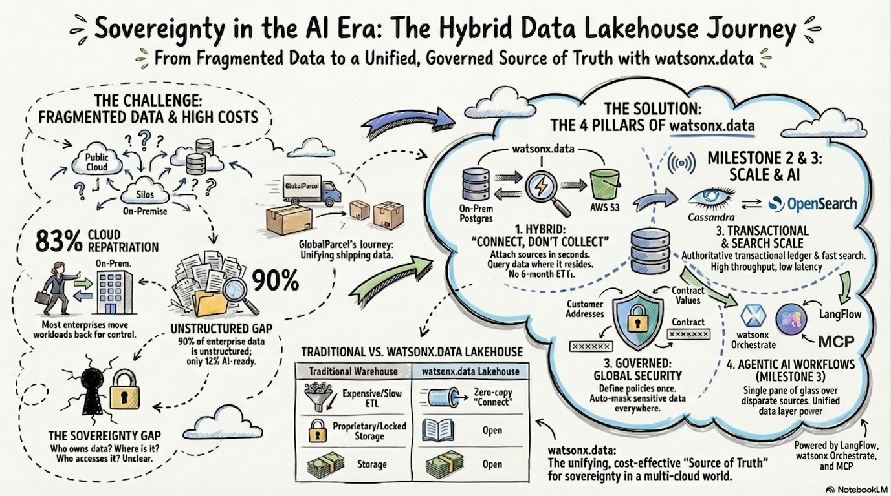

# Global Parcel Hybrid Lakehouse — workshop series

Global Parcel wants **control and clarity over shipping data** while meeting **data sovereignty** expectations. At the same time, **fuel and logistics costs swing with world events**—published base rates do not tell the whole story unless you can reconcile **historic parcel flows** with **current surcharge regimes** in governed systems you operate.

They turn to the **watsonx** stack (**watsonx.data** locally for this curriculum) so analytics stay **hybrid, open-table, and federated**, not locked in a distant black box.

This repository expands the narrative into a **multi-session** workshop: foundational lakehouse federation, realtime operations, then AI acceleration.



---

## Situation

- **Operational data** spans historical parcel events, regions, carriers, delays, and cost components.
- **Policy and sovereignty** discourage “send everything to one opaque cloud”; teams need **regions and platforms they can justify**.
- **Market volatility** (energy, disruptions, geopolitical stress) pushes **fuel surcharges** and operational costs faster than analysts can reconcile spreadsheet extracts.

---

## Use case

Build a **hybrid lakehouse** pattern on a **local Kubernetes (kind)** developer footprint:

1. Keep **parcel history** in **Apache Iceberg** on **object storage** backed by watsonx.data.
2. Run **SQL (Presto-class engines)** over that history for latency, volume, and cost patterns.
3. **Federate live surcharge reference data** from **PostgreSQL** so invoice-style questions (**base rate + surcharge** by geography) resolve in **one governed query**.

---

## Business case

| Stakeholder concern | How this demo answers it |
| --- | --- |
| Finance / billing | Exposure to **true billable totals**, not stale list prices divorced from surcharge tables. |
| Operations | **Where delays and cost pressure cluster** before they hit customer SLAs and margin. |
| Trust & compliance | **Data stays under patterns you approve**—open table formats, standard SQL, JDBC-style federation—not a single proprietary dumping ground. |

---

## Lab journey (sessions)

Work in order unless a session states otherwise:

| Session | Focus | README |
| --- | --- | --- |
| **01 — Data federation** | watsonx.data on kind, Iceberg ingest, Presto queries, **PostgreSQL federation** (`shipping_ops.public.fuel_surcharge` + shipping history). | [`01-data-federation/README.md`](01-data-federation/README.md) |
| **02 — Realtime operations** | Live parcel events with Cassandra (authoritative ledger) + OpenSearch (customer-facing search), including audit and tracking UIs. | [`02-realtime-operations/README.md`](02-realtime-operations/README.md) |
| **03 — Accelerate AI** | **watsonx Orchestrate** (Developer Edition + ADK) for agentic automation on top of curated data products. | [`03-accelerate-ai/README.md`](03-accelerate-ai/README.md) |

---

## Delivery modes

- **Live demo mode (time-boxed):** run each session's minimum path and expected checks only.
- **Self-paced mode (deep dive):** run the full steps, optional checks, and extension notes.

## Install prerequisites (all sessions)

Fulfill these **before** opening session-specific guides:

| Area | Requirement |
| --- | --- |
| **Containers & Kubernetes** | A supported **Docker** or **Podman** path, **`kubectl`**, **`helm`**, and **`kind`**. Follow **[container-fundamentals](https://github.com/michelderu/container-fundamentals)** ([course overview](https://github.com/michelderu/container-fundamentals#how-to-use-this-material)). |
| **Python** | **3.11+**. A **virtual environment at this repository root** (`.venv`) |

---

## Test for readiness

Use this sanity block on your machine after aligning with **container-fundamentals** and creating **repository root `.venv`**.

```bash
# Container runtime — at least one path should succeed
command -v docker  && docker version
command -v podman && podman version
command -v docker  && docker info >/dev/null 2>&1 && echo "docker: daemon OK" || true
command -v podman  && podman info >/dev/null 2>&1 && echo "podman: reachable" || true

# Cluster tooling
kubectl version --client
helm version
kind version
```

Now create the Python virtual environment:

```bash
python -m venv .venv
source .venv/bin/activate      # On Windows: .venv\Scripts\activate

pip install --upgrade pip
```

Great! You're ready for the next steps!
---

## Quick start pointer

Begin with [**`01-data-federation/README.md`**](01-data-federation/README.md): environment setup (`cd 01-data-federation`, generators, lakehouse UI, Postgres federation SQL).

Then continue with [**`02-realtime-operations/README.md`**](02-realtime-operations/README.md), followed by [**`03-accelerate-ai/README.md`**](03-accelerate-ai/README.md).
