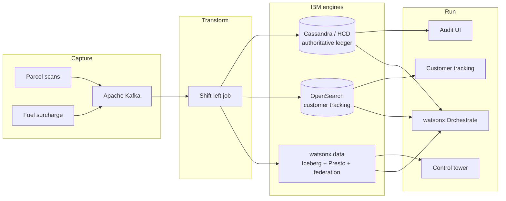

# Global Parcel StreamHouse

**Capture the business. Run the business.**

Shaun Clowes introduced StreamHouse as a simple idea: continuously **capture**, **transform**, and **query** real-time data so the company is looking at a **current view of the business**.

This workshop makes that idea concrete through a realistic Global Parcel scenario — and through the **IBM watsonx.data** vision: one platform, **fit-for-purpose engines**. You still build it yourself. The future of data and AI will not be defined by architecture diagrams. It will be defined by developers who turn these technologies into products that help customers understand and run their business in real time.


```mermaid
flowchart LR
    subgraph capture [Capture]
        P[Parcel scans]
        F[Fuel surcharge]
        K[Apache Kafka]
        P --> K
        F --> K
    end
    subgraph transform [Transform]
        T[Shift-left job]
        K --> T
    end
    subgraph ibm [IBM engines]
        CASS[(Cassandra / HCD<br/>authoritative ledger)]
        OS[(OpenSearch<br/>customer tracking)]
        WXD[watsonx.data<br/>Iceberg + Presto + federation]
        T --> CASS
        T --> OS
        T --> WXD
    end
    subgraph run [Run]
        CASS --> AUDIT[Audit UI]
        OS --> CX[Customer tracking]
        WXD --> TOWER[Control tower]
        CASS --> AI[watsonx Orchestrate]
        OS --> AI
        WXD --> AI
    end
```

---

## IBM products in this vision

StreamHouse is the **spine**. These are the engines the spine writes and the products you show:

| Product | Role in StreamHouse | How you run it (developer-first) |
| --- | --- | --- |
| **Apache Kafka** | Capture bus | Official `apache/kafka` image (KRaft) — same idea as Apache Cassandra in Docker |
| **Apache Flink SQL** | Production transform contract | [`transform/flink/shift_left.sql`](transform/flink/shift_left.sql); laptop runtime is the Python job |
| **IBM watsonx.data** | Iceberg + Presto + PostgreSQL federation | **Developer Edition** — [`01-data-federation`](01-data-federation/README.md) |
| **Apache Cassandra** (DataStax HCD in product) | Authoritative parcel ledger | Official `cassandra` image — [`02-realtime-operations`](02-realtime-operations/README.md) |
| **OpenSearch** | Customer tracking search | Official OpenSearch image — session 02 |
| **watsonx Orchestrate** | Agents on those data products | **Developer Edition / ADK** — [`03-accelerate-ai`](03-accelerate-ai/README.md) |

Confluent Cloud **Tableflow** is the managed Kafka→Iceberg path watsonx.data federates in production. On the laptop we materialize the same contract with open table files (`tableflow/materialize.py`) so you do not need a cloud account to learn the loop.

Capture **once**. Transform **once**. Then each IBM engine does the job it is good at. That is the opposite of dual-writing from the producer, and the opposite of three disconnected labs.

---

## Surfaces

| Surface | URL | Reads |
| --- | --- | --- |
| Control tower | http://localhost:8088/tower/ | Current view (lakehouse materialization) |
| Customer tracking | http://localhost:8088/customer-ui/ | **OpenSearch** |
| Audit / reconciliation | http://localhost:8088/audit-ui/ | **Cassandra** |
| Ask the business | http://localhost:8088/ask/ | Current-view tools (Orchestrate in session 03) |
| OpenSearch Dashboards | http://localhost:5601 | `parcel-events-live` |
| Kafka UI | http://localhost:8080 | Capture topics (`parcel.events`, `fuel.surcharge`) |
| watsonx.data console | https://localhost:6443 | Iceberg + federated PostgreSQL |

Suggested parcels: `PCL-LIVE-000001`, `PCL-000001`.

---

## Prerequisites

- Docker (or Podman) with Compose
- Python **3.11+**
- For session 01: **kind**, **kubectl**, **helm** (watsonx.data Developer Edition) — see [container-fundamentals](https://github.com/michelderu/container-fundamentals)
- For session 03: watsonx Orchestrate ADK credentials (16 GB RAM recommended)

```bash
python -m venv .venv
source .venv/bin/activate
pip install -U pip
pip install -r requirements.txt
```

---

## Build it

Work from the repository root. Keep `PYTHONPATH=.`.

### 1. Capture — put Global Parcel in motion

```bash
docker compose up -d
docker compose ps
```

Wait until **Cassandra** is `healthy` (first boot 1–2 minutes), OpenSearch answers on `:9200`, and Kafka on `:9092`. Inspect capture like you would CQL:

```bash
docker compose exec kafka /opt/kafka/bin/kafka-topics.sh --bootstrap-server localhost:9092 --list
```

Or open Kafka UI at [http://localhost:8080](http://localhost:8080). Then:

```bash
PYTHONPATH=. python -m capture.produce
```

This replays historical journeys (`PCL-000001` …) and streams live scans (`PCL-LIVE-…`) plus fuel surcharge ticks onto Kafka. The business is a stream — including reference data finance used to dump nightly.

Details: [`capture/README.md`](capture/README.md).

### 2. Transform — shift left into IBM engines

In a second terminal:

```bash
PYTHONPATH=. python -m transform.shift_left
```

Each scan is priced against the latest surcharge and SLA-flagged, then written to:

- **Cassandra** `globalparcel_ops.parcel_events_by_parcel` — ledger
- **OpenSearch** `parcel-events-live` — customer search
- Kafka `parcel.events.enriched` / `parcel.current` — for lakehouse Tableflow

Cassandra schema is created on first connect (same table as session 02). Flink SQL for the same contract: [`transform/flink/shift_left.sql`](transform/flink/shift_left.sql).

Details: [`transform/README.md`](transform/README.md) and [`02-realtime-operations/README.md`](02-realtime-operations/README.md).

### 3. Query — watsonx.data current view

Laptop materialization (always on):

```bash
PYTHONPATH=. python -m tableflow.materialize
```

Topics become open tables under `data/warehouse/`. SQL: [`query/current_view.sql`](query/current_view.sql).

**IBM query plane (session 01):** run [`01-data-federation/README.md`](01-data-federation/README.md). Load shipping history into **Iceberg**, start PostgreSQL fuel surcharge, **federate** it in watsonx.data, and join history + live surcharge in one Presto query — governed lakehouse SQL over the same Global Parcel business.

Details: [`tableflow/README.md`](tableflow/README.md), [`query/README.md`](query/README.md).

### 4. Run — apps and AI on those products

```bash
PYTHONPATH=. uvicorn apps.api:app --host 0.0.0.0 --port 8088
```

| You want to show | Open |
| --- | --- |
| Current picture of the business | http://localhost:8088/tower/ |
| Customer “where is my parcel?” | http://localhost:8088/customer-ui/ (**OpenSearch**) |
| Dispute / source of truth | http://localhost:8088/audit-ui/ (**Cassandra**) |
| Agentic AI | [`03-accelerate-ai/README.md`](03-accelerate-ai/README.md) (**watsonx Orchestrate** + Langflow on the ledger and customer API) |

Details: [`apps/README.md`](apps/README.md).

---

## Concepts the demo is designed to land

| Teaser phrase | Where you feel it |
| --- | --- |
| Continuously capturing | Kafka UI / `kafka-console-consumer.sh` + `capture.produce` |
| Transforming | Shift-left job writing **Cassandra + OpenSearch + Iceberg** |
| Querying real-time data | watsonx.data Presto + control tower SQL |
| Current view of the business | Control tower, and federated surcharge joins |
| Historical and live | `PCL-000001` (replay) and `PCL-LIVE-000001` (now) |
| Applications, analytics, and AI | Customer UI, lakehouse SQL, Orchestrate |
| Fit-for-purpose engines | Ledger ≠ search ≠ lakehouse — one capture |

---

## Fast path (facilitators)

```bash
docker compose up -d
source .venv/bin/activate
./scripts/run-streamhouse.sh
```

Then open http://localhost:8088/tower/ and the Cassandra / OpenSearch UIs above. Session 01 and 03 remain the watsonx.data and Orchestrate labs.

---

## Stop

Ctrl+C the Python processes, then:

```bash
docker compose down
rm -rf data/
```
